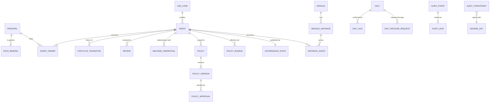

# Domain and data model v0.1

| | |
| --- | --- |
| **Status** | Accepted v0.1, 2026-09-29 (plan [P0-02](../plans/phase-0/P0-02-domain-and-data-model.md)) |
| **Date** | 2026-09-29 |
| **Schema** | [`internal/platform/db/migrations/00001_init.sql`](../../internal/platform/db/migrations/00001_init.sql) |
| **Related** | [Agent lifecycle](lifecycle.md), [architecture](mvp-architecture.md), [requirements](../requirements/mvp-requirements.md), [ADR-0003](../adr/0003-postgresql-only-stateful-dependency.md), [ADR-0005](../adr/0005-edge-enforcement-with-leases.md), [ADR-0006](../adr/0006-tamper-evident-audit-log.md) |

This document defines the vocabulary, the entities and their invariants, and the physical schema of the White Tower core. Every Phase 1 plan builds on it. It covers the MVP and shows where Phase 2 and 3 capabilities attach.

## 1. Modeling decisions

| Question | Decision | Why |
| --- | --- | --- |
| **One agent in several environments** (open question Q2) | One logical agent. Its credentials carry an environment label (production or non-production). Where it runs is descriptive metadata, and running instances are reported by enforcement points. | Ownership, use case, policies and approvals belong to the agent, not to each deployment; duplicating them per environment would duplicate governance. Runtime reality is captured by instances. |
| **Tenancy** (open question Q3) | One organization per deployment, with no tenant column. | White Tower is self-hosted by each organization. Organization-wide settings live in one table, so a tenant key could be added in a single migration if ever needed. |
| **Identifiers** | UUIDv7, generated by the application; human-readable slugs for agents and modules | Time-ordered, collision-free without coordination, index-friendly |
| **Deletion** | Governance records are never deleted: they are retired or superseded. Only short-lived operational data (sessions, used assertions, outbox) is cleaned up by jobs | Accountability and audit; the runtime role has no DELETE privilege on governance tables |
| **Time** | `timestamptz`, UTC. Audit events keep the source's time and the server's ingestion time (NFR-19) | Clock skew between agents and the core must never corrupt ordering |
| **Concurrency** | A `version` column on every table the console edits, exposed as an ETag (API-03) | Lost updates between two approvers are refused, not silent |
| **Enumerations** | `text` with `CHECK` constraints, not PostgreSQL enum types | Values can evolve inside ordinary transactional migrations |
| **JSONB** | Only for extensible, unqueried structures: labels, manifests, harness declarations, attestations, settings values, bundle manifests | Everything queried or constrained is a real column |
| **Where invariants live** | In the domain services first (P1 plans), and again in the database for the critical ones (append-only audit, separation of duties, two-person release, no private keys) | Defense in depth: a bug in the core must not be enough to break a governance rule |
| **Privileges** | The core runs as a member of `whitetower_runtime`, which receives table-by-table grants; nothing is granted by default | Least privilege; audit tables are append-only even for the core |

## 2. Glossary

One name per concept, used identically in code, API, console and documentation.

| Term | Meaning | Table |
| --- | --- | --- |
| Principal | A human, or a service account acting for a human, known to White Tower | `principals` |
| Role binding | A role granted inside White Tower, on top of the roles mapped from IdP groups | `role_bindings` |
| Use case | The business purpose an agent serves, validated by the advisory committee | `use_cases` |
| Agent | An AI agent under governance, in-house or third-party | `agents` |
| Owner / delegate | The one accountable human for an agent, and the people who may act for them | `agent_owners` |
| Lifecycle state | Where the agent is in the governance process ([lifecycle](lifecycle.md)) | `agents.lifecycle_state` |
| Run state | Whether the agent may act right now (`running`) or is stopped by the kill switch (`halted`) | `governance_state`, `fleet_state` |
| Review | The periodic confirmation that an agent is still needed and correctly governed | `reviews` |
| Machine credential | A public key an agent or a module instance signs its token requests with | `machine_credentials` |
| Policy / policy version | A global or agent-specific rule set, and its immutable versions | `policies`, `policy_versions` |
| Bundle | The signed, versioned effective policy set of one agent | `policy_bundles` |
| Module / instance | A pluggable component declared by a manifest, and one running process of it | `modules`, `module_instances` |
| Enforcement point | An instance that applies governance to agents at runtime | `module_instances`, `instance_agents` |
| Governance state | What the core publishes to enforcement points about each agent | `governance_state` |
| Halt / release | The kill switch's stop, and its two-person reversal | `halts`, `halt_release_requests` |
| Acknowledgement | An instance's report of what a halt achieved, layer by layer | `halt_acks` |
| Lease | The time an enforcement point may keep deciding without hearing from the core | `governance_state.lease_ttl_seconds` |
| Audit event / checkpoint | A record of evidence, and a signed statement of the audit log's state | `audit_events`, `audit_checkpoints` |
| Coverage level | C0 to C3, computed from credentials, instances, decisions and drills (requirements, section 3) | Computed, not stored |

## 3. Entities

The full list of columns and constraints is in the schema file. The sections below give each entity's purpose and invariants; **(DB)** marks an invariant the database enforces as well.

### 3.1 People and access

| Entity | Purpose | Invariants |
| --- | --- | --- |
| `principals` | Humans (from the IdP) and service accounts | A human has an IdP issuer and subject, unique per issuer (DB). A service account names a responsible human (DB). Status is `active` or `inactive`; deactivation feeds automatic suspension (INV-05). |
| `role_bindings` | Roles granted inside White Tower | One active binding per principal and role (DB); a reason is mandatory (DB); revocation records who and when (DB) |
| `sessions` | Server-side console sessions (ADR-0009) | Session IDs and CSRF tokens are stored hashed (DB); idle and absolute expiry; revocable |
| `api_tokens` | Personal access tokens and service account tokens | Stored hashed (DB); always expire (DB); scopes are a subset of the owner's permissions (domain) |

### 3.2 Inventory

| Entity | Purpose | Invariants |
| --- | --- | --- |
| `use_cases` | Business purpose, data categories, affected persons, EU AI Act classification | A `prohibited` use case can never be validated (guard in [lifecycle](lifecycle.md)) |
| `use_case_decisions` | Every validation, rejection or change request, with its comment | Append-only (DB); a comment is mandatory (DB) |
| `agents` | The registry: metadata, risk tier, data categories, lifecycle state, harness declaration, halt mode, labels | Slug format (DB); suspension and retirement recorded consistently (DB); `ready` and `active` need a harness declaration (DB); lifecycle rules in [lifecycle](lifecycle.md) |
| `agent_owners` | Primary owner and delegates, with full history | At most one active primary owner (DB), at least one (domain); one active assignment per person (DB) |
| `ownership_transfers` | Transfers started by an owner, waiting for the new owner to accept | One pending transfer per agent (DB); never to oneself (DB) |
| `lifecycle_transitions` | Every state change, with actor, reason, comment and state version | Append-only, including for the table owner (DB) |
| `reviews` | Periodic reviews: due date, grace period, attestation, sign-off | One open review per agent (DB); sign-off by someone other than the person who completed the review (DB) |

### 3.3 Machine identity

| Entity | Purpose | Invariants |
| --- | --- | --- |
| `signing_keys` | Public halves and status of the token, bundle and checkpoint keys | Private keys never enter the database (DB: a JWK with a private member is refused); one active key per purpose (DB) |
| `machine_credentials` | Public keys of agents and standalone modules | Belongs to exactly one agent or one module (DB); agent keys carry an environment label (DB); no private keys (DB); revocation recorded (DB) |
| `workload_issuers`, `workload_identity_bindings` | Kubernetes clusters trusted for workload identity federation, and service account to agent mappings (AID-07) | One active binding per issuer and subject (DB) |
| `used_assertions` | Replay protection for client assertions | Primary key on client and assertion ID (DB); rows expire within minutes |

### 3.4 Policies

| Entity | Purpose | Invariants |
| --- | --- | --- |
| `policies` | A named rule set, global or agent-specific, in Cedar or Rego | Agent scope if and only if an agent is referenced (DB) |
| `policy_versions` | Immutable content, hash, tests, validation results, status | Content, hash, tests and author cannot change after submission (DB trigger); versions are never deleted (DB); one active version per policy (DB) |
| `policy_approvals` | Decisions of the steering or advisory committee | The author can never decide on their own version (DB trigger, HUM-04); rejections need a comment (DB); append-only (DB) |
| `policy_bundles` | Signed effective policy sets, versioned per agent | Monotonic version per agent (DB unique); append-only (DB) |

### 3.5 Runtime

| Entity | Purpose | Invariants |
| --- | --- | --- |
| `modules` | Registered modules and their manifests | Slug format (DB); approval and revocation recorded consistently (DB) |
| `module_agent_bindings` | Which agents a standalone module may serve: named agents, or all agents, as the network quarantine module of a cluster is (KIL-10) | One active binding per module and agent, and at most one active binding to all agents per module (DB) |
| `module_instances` | Connected, disconnected and lost instances, with lease TTL and contract version | An instance authenticated as an agent names that agent (DB); lease TTL between 10 and 300 seconds (DB) |
| `instance_agents` | Per instance and agent: active bundle version, last observed state version | Drives drift detection (P1-06) and halt tracking (P1-08) |
| `governance_state` | One record per agent: lifecycle state, run state, agent-level halts, bundle, lease TTL, halt mode, policy attributes, state version | `halted` if and only if at least one halt covers the agent (DB); lease TTL bounds (DB); halt mode values (DB) |
| `fleet_state` | The single fleet-wide record | Exactly one row (DB); `halted` if and only if a fleet halt is active (DB) |

A fleet halt changes one row (`fleet_state`), not one row per agent. Selector halts are folded into each matching agent's `agent_halt_ids` when issued, and into agents registered later.

### 3.6 Kill switch

| Entity | Purpose | Invariants |
| --- | --- | --- |
| `halts` | Agent, fleet and selector halts, with reason, issuer, status and state version | The target matches the scope (DB); drills target one agent (DB); only a human, break-glass or system issuer (DB); **released only through an approved release request, except drills** (DB trigger); never reopened once released (DB trigger) |
| `halt_acks` | Per instance and agent: gate closed, interruption confirmed or not, process terminated, network quarantine applied and the number of workloads it covers | Layers reported separately, so an acknowledgement never overstates what stopped (S1 finding) |
| `halt_release_requests` | Two-person release | Requester and approver are different people (DB, KIL-05); one pending request per halt (DB) |

### 3.7 Audit

| Entity | Purpose | Invariants |
| --- | --- | --- |
| `audit_events` | Evidence, partitioned by month of ingestion. The RFC 8785 canonical JSON is the Merkle leaf; the other columns are extracted from it for queries | Append-only for everyone, including UPDATE, DELETE and TRUNCATE by the owner (DB) |
| `audit_event_ids` | De-duplication of events delivered more than once, partitioned like the events | Unique per source, event ID and month (DB); append-only (DB) |
| `audit_source_sequences` | Last sequence number seen per source, for gap detection (AUD-02) | |
| `audit_leaves`, `audit_tree_hashes` | The Merkle tree ([ADR-0006](../adr/0006-tamper-evident-audit-log.md)) | Append-only, including TRUNCATE (DB); hashes are 32 bytes (DB) |
| `audit_checkpoints` | Signed checkpoints (C2SP signed notes) | Append-only (DB); signed by a registered checkpoint key (DB) |
| `audit_export_cursors` | Position of each export sink | |

### 3.8 Platform

| Entity | Purpose |
| --- | --- |
| `settings` | Configurable defaults (section 5), edited by administrators, versioned |
| `outbox` | Events to publish after commit (notifications, webhooks) |
| `job_state` | Last run of each background job, for health and metrics |
| `inbox_items` | Pending work per person or per role (UI-09): validations, approvals, reviews, releases |

## 4. The governance state record

What the core publishes to enforcement points for each agent (ADR-0005). Its wire form is `AgentState` in the [module contracts](../contracts/module-contract-v0.1.md#51-the-state), which confirmed this record in P0-03 and added the halt mode and the policy attributes.

| Field | Source |
| --- | --- |
| Agent ID | `governance_state.agent_id` |
| Lifecycle state, which decides whether the gate may open ([lifecycle](lifecycle.md), section 1) | `governance_state.lifecycle_state` |
| Effective run state | `halted` if `agent_halt_ids` is not empty or the fleet is halted |
| Halt IDs, scopes and issue times; reasons stay in the core | `agent_halt_ids`, `fleet_state.halt_ids` → `halts` |
| Bundle reference: version, SHA-256, signature | `governance_state.bundle_id` → `policy_bundles` |
| Lease TTL | `governance_state.lease_ttl_seconds`, from the risk tier (setting `killswitch.lease_ttl_seconds`) |
| Halt mode chosen by the owner | `governance_state.halt_mode`, copied from `agents.halt_mode` |
| Attributes for policies: slug, kind, risk tier, data categories, labels, owner ID. The environment is not here: it comes from each enforcement point's credential | `governance_state.attributes` |
| State version | `governance_state.state_version`, from the global sequence `governance_state_version_seq` |

Every change takes a new number from the global sequence in the transaction that makes it. Watch streams resume from the last version an instance saw, and fall back to a snapshot when the gap is too large.

## 5. Defaults

Initial values of `settings`, all editable by administrators:

| Setting | Default |
| --- | --- |
| `lifecycle.review_interval_days` | low 365, medium 365, high 180, critical 90 |
| `lifecycle.review_grace_days` | 14 |
| `lifecycle.review_reminder_days` | 30, 7 and 1 days before the due date |
| `lifecycle.review_signoff_risk_tiers` | high, critical |
| `killswitch.lease_ttl_seconds` | low 60, medium 60, high 30, critical 15 (confirmed by spike S2) |
| `killswitch.unconfirmed_after_seconds` | 10 |
| `audit.retention_months` | 6, the EU AI Act minimum (NFR-10) |
| `inventory.data_categories` | public data, internal documents, customer data, employee data, personal data, special category data, financial data, health data, source code, credentials |

Risk tiers are `low`, `medium`, `high` and `critical`. The EU AI Act classification, on agents and use cases, is `prohibited`, `high_risk`, `limited`, `minimal` or `not_assessed`.

## 6. Traceability

Every Must requirement of the inventory, identity, policy, audit and kill switch areas maps to the model:

| Requirement | Entities and fields |
| --- | --- |
| INV-01 mandatory metadata | `agents` columns, `use_case_id` |
| INV-02 one accountable owner | `agent_owners` (unique primary), `principals.status` |
| INV-03 validated use case | `use_cases.status`, `use_case_decisions` |
| INV-04 lifecycle with guards and audit | `agents.lifecycle_state`, `lifecycle_transitions`, [lifecycle](lifecycle.md) |
| INV-05 automatic suspension | `principals.status`, `reviews.grace_ends_at`, `agents.suspension_reason` |
| INV-06 periodic reviews | `reviews`, `settings` (intervals, reminders) |
| INV-07 third-party agents at C0 | `agents.kind`, coverage computed from credentials and instances |
| AID-01 stable identity | `agents.id`; SPIFFE ID derived from it |
| AID-02 asymmetric credentials | `machine_credentials.public_jwk` (no private members, DB) |
| AID-03 short-lived tokens and JWKS | `signing_keys` (purpose `token`); tokens themselves are not stored |
| AID-04 issuance gated by state | `agents.lifecycle_state`, `governance_state`, `machine_credentials.environment` |
| AID-05 rotation and revocation | `machine_credentials.status`, `signing_keys.status` |
| AID-06 module identities | `machine_credentials.module_id`, `module_instances.identity_kind` |
| POL-01 versioned policies with scope | `policies`, `policy_versions` |
| POL-02 approvals, author excluded | `policy_approvals` (DB trigger) |
| POL-03 combination semantics | Contract (P0-03); bundles record the algorithm in `policy_bundles.manifest` |
| POL-04 active agent needs a policy | Guard `agent_policy_active` |
| POL-05 signed bundles, drift | `policy_bundles`, `instance_agents.active_bundle_version` |
| POL-06 decision input model | Contract (P0-03) |
| AUD-01 audit in the same transaction | `audit_events` written by domain transactions |
| AUD-02 idempotent ingestion, gaps | `audit_event_ids`, `audit_source_sequences` |
| AUD-03 Merkle tree and checkpoints | `audit_leaves`, `audit_tree_hashes`, `audit_checkpoints` |
| AUD-04 verification | Canonical bytes kept in `audit_events.canonical` |
| AUD-05 search | Indexes on agent, type and actor per partition |
| AUD-06 export | `audit_export_cursors` |
| KIL-01 to KIL-03 halts and acknowledgements | `halts`, `halt_acks`, `governance_state.run_state`, `fleet_state` |
| KIL-04 lease backstop | `governance_state.lease_ttl_seconds`, `module_instances.status` (`lost`) |
| KIL-05 two-person release | `halt_release_requests` (DB), release trigger on `halts` (DB) |
| KIL-06 halt suspends the agent | Transition T12 in [lifecycle](lifecycle.md) |
| KIL-07 reconnecting instances start halted | `governance_state` snapshot sent before any action is allowed |
| KIL-10 network quarantine | `module_agent_bindings` (scope `all`), `halt_acks.quarantined_at` and `quarantined_workloads` |

## 7. Personal data

White Tower processes personal data about the people who govern agents. The rules below follow NFR-20 and were shared with the threat model (P0-04).

| Data | Where | Purpose | Retention | On export |
| --- | --- | --- | --- | --- |
| Name, email, IdP subject, groups, last login | `principals` | Authentication, accountability, notifications | While referenced by governance records. An erasure request replaces name and email with placeholders and keeps the ID, so the history stays consistent | Pseudonymized on request |
| Principal IDs in history and evidence | `lifecycle_transitions`, `agent_owners`, approvals, `audit_events.actor_id` | Accountability | With the record; audit follows its retention (six months minimum) | Principal IDs are already pseudonymous |
| Arguments of governed actions | Decision and action events from enforcement points | Evidence of what the agent did | Audit retention | The event catalog (P0-03) must require redaction or hashing of arguments that can contain personal data |

Audit events identify people by pseudonymous principal ID, never by name or email.

## 8. Forward compatibility

Later capabilities attach without redesigning the MVP schema. Their tables are not created yet.

| Capability | Where it attaches |
| --- | --- |
| LLM gateway, quotas and cost (Phase 2) | Gateway processes are module instances with the `llm-gateway` capability; quotas and usage in new tables keyed by agent, usage partitioned like the audit log |
| MCP gateway (Phase 2) | Tools and MCP servers become catalog tables, referenced as resources by policies; gateways are enforcement points |
| Skills repository (Phase 2) | Skills, signed versions, reviews and agent bindings in new tables; signatures reuse the key model |
| Enforced harness (Phase 2) | Harness profiles in a table; `agents.harness` moves from a declaration to a reference |
| Per-task tokens (Phase 2) | Token exchange is stateless; evidence goes to the audit log |
| Accepted providers and jurisdictions (Phase 2) | A catalog approved by the steering committee, referenced by policies |
| Discovery (Phase 3) | Findings in a new table linked to agents; `agents.source = 'discovered'` is already allowed |
| Multi-tenancy (not planned) | A tenant key added to every table and to `settings`, in one migration |

## 9. Physical schema

**Ownership and roles.**

- The migration role owns the `whitetower` schema.
- The core connects as a login role that is a member of `whitetower_runtime`.
- The migration creates that group role when it may create roles, as in the development setup; otherwise a database administrator creates it first.

**Privileges.**

| Tables | Runtime role may |
| --- | --- |
| Audit tables, lifecycle history, use case decisions, policy approvals, bundles | SELECT and INSERT only (append-only) |
| Sessions, used assertions, outbox | SELECT, INSERT, UPDATE and DELETE (short-lived data cleaned by jobs) |
| Every other governance table | SELECT, INSERT and UPDATE, never DELETE |

**Partitions.**

- `audit_events` and `audit_event_ids` are partitioned by month.
- `whitetower.ensure_audit_partitions(months_ahead)` creates the missing partitions with the owner's rights (SECURITY DEFINER, fixed `search_path`), so the runtime role needs no DDL. The migration creates the current month and three ahead; a job keeps them ahead (P1-02).
- There is no default partition, so an event outside the existing partitions fails its transaction instead of landing somewhere unexpected: fail-closed.

**Retention.** Dropping old partitions happens in P1-02, which also decides how long leaves and de-duplication keys are kept. Tree hashes and checkpoints are kept, so the remaining log still verifies (ADR-0006).

**Verification, 2026-09-29.**

- **Schema checks:** the migration applies cleanly on PostgreSQL 16.15 and 17.11, and the 28 checks of [`hack/db/schema_checks.sql`](../../hack/db/schema_checks.sql) pass on both. They cover append-only evidence (runtime role and owner), separation of duties, the two-person release, the absence of private keys, the unique primary owner, the lifecycle constraints, module bindings and the audit partitions.
- **Code generation:** `sqlc` 1.31.1 parses the whole schema and generates typed Go code for representative queries (agents, governance changes since a version, audit insertion, unsealed events). By default it maps UUIDs to `pgtype.UUID`; P1-01 configures the type the code will use.

## 10. Left to later plans

| Topic | Plan |
| --- | --- |
| `sqlc` configuration and type overrides; checks turned into Go integration tests | P1-01 |
| Retention of audit partitions, leaves and de-duplication keys | P1-02 |
| The queue of unsealed events validated by [spike S3](../spikes/S3-audit-throughput.md) (`audit_unsealed`) | P1-02 |
| Lifecycle guards generated from `agent-lifecycle.yaml` | P1-04 |
| Bundle content size and storage by hash | P1-06 |
| Redaction of personal data in event arguments | P0-03 (event catalog) |
