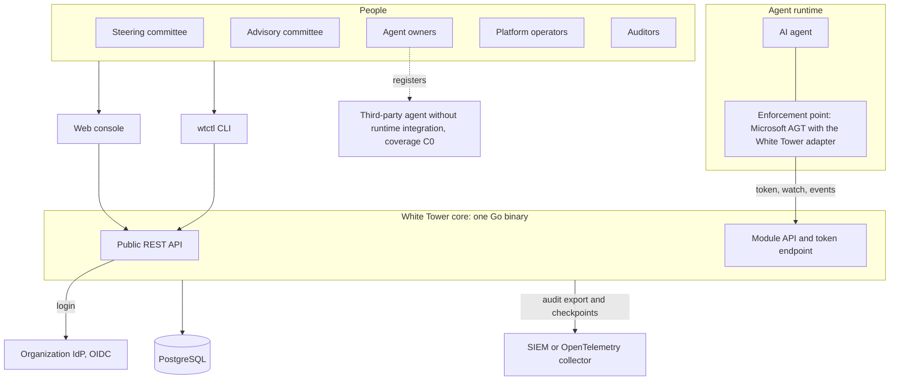
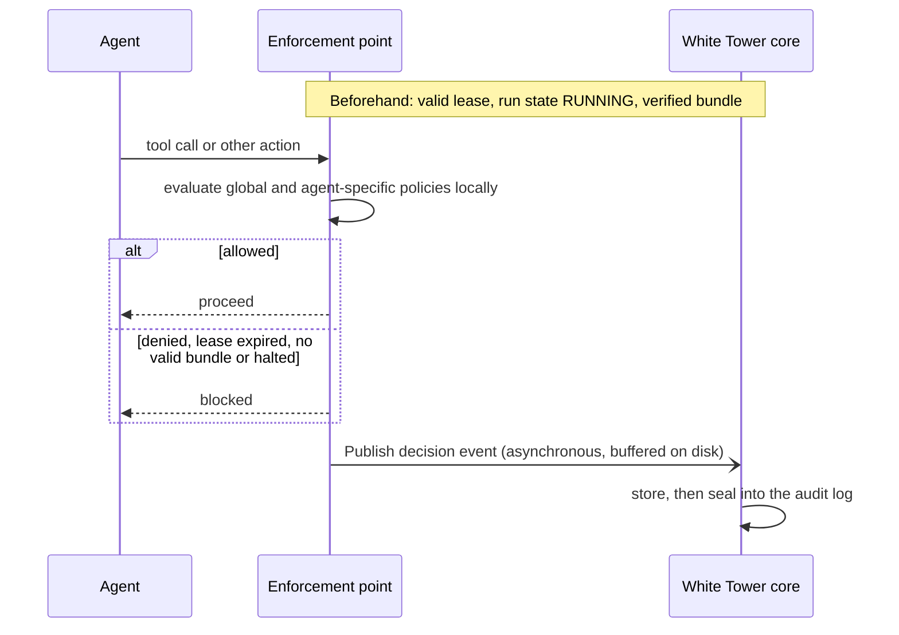
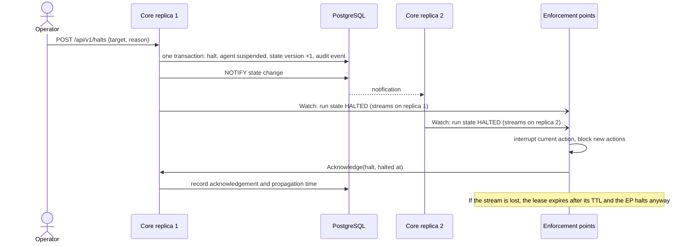
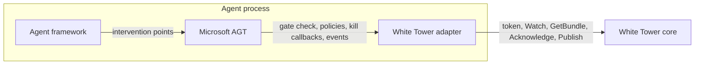
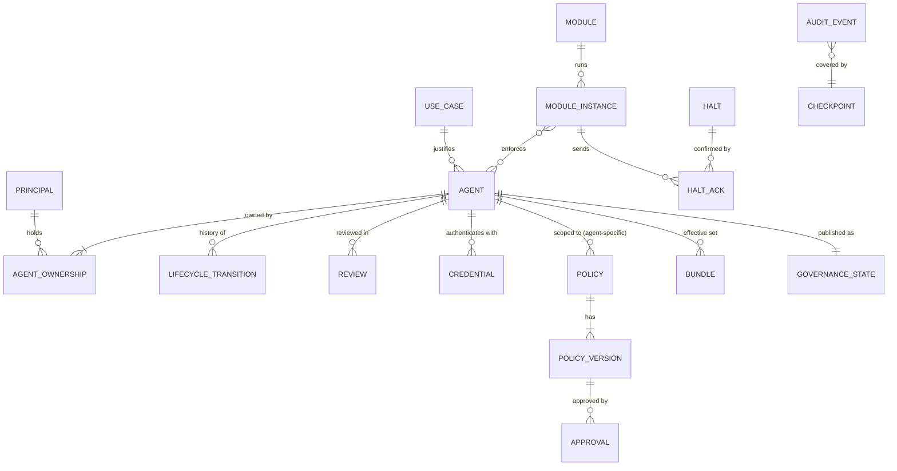

# White Tower: MVP architecture

| | |
| --- | --- |
| **Status** | Draft v0.1, open for review |
| **Date** | 2026-09-28 |
| **Related** | [Requirements](../requirements/mvp-requirements.md), [ADRs](../adr/README.md), [Implementation plans](../plans/README.md) |

This document describes how the MVP is built: its components, the interfaces between them, the flows that matter most, and how it is deployed. The reasons behind each choice are in the ADRs; this document only links to them. Normative details (exact schemas, messages and states) are produced by the Phase 0 plans and will replace the sketches marked as such here.

---

## 1. Architectural drivers

| Driver | Requirements | Answer |
| --- | --- | --- |
| Fail closed without putting the core in the latency path of agent actions | NFR-01, NFR-02 | Decisions at the edge; governance state pushed to enforcement points, which hold leases ([ADR-0005](../adr/0005-edge-enforcement-with-leases.md)) |
| Stop running agents within seconds, with a bounded worst case | KIL-01 to KIL-07, NFR-03 to NFR-05 | Halts are pushed state changes, acknowledged per instance; lease expiry is the backstop ([ADR-0005](../adr/0005-edge-enforcement-with-leases.md)) |
| Evidence that holds up even against a privileged insider | AUD-01 to AUD-06 | Merkle tree log with signed checkpoints anchored outside ([ADR-0006](../adr/0006-tamper-evident-audit-log.md)) |
| Governance rules that are enforced, not just documented | AID-04, KIL-06, POL-04 | Token issuance gated by lifecycle and run state in the same transaction ([ADR-0010](../adr/0010-built-in-agent-token-issuer.md)) |
| Self-hosted, air-gapped, few moving parts | CON-02, NFR-14 | One Go binary with the console embedded, plus PostgreSQL ([ADR-0001](../adr/0001-backend-language-go.md), [ADR-0002](../adr/0002-frontend-typescript-react.md), [ADR-0003](../adr/0003-postgresql-only-stateful-dependency.md)) |
| Interchangeable modules | MOD-01 to MOD-08 | Versioned contracts in standard formats, conformance kit ([ADR-0004](../adr/0004-api-and-contract-formats.md)) |
| A small core | CON-05 | Five functions in the core; everything else behind the module contract |

## 2. System context

Third-party agents that cannot be integrated at runtime still get an inventory record, an owner, a use case and a policy (coverage C0). Governed agents run next to an enforcement point that talks to the core.

## 3. The core

The core is one process with two network listeners, a set of domain packages and background jobs. All replicas are identical and stateless; state lives in PostgreSQL.

```mermaid
flowchart LR
    subgraph transport[Transport, thin]
        REST[REST handlers, OpenAPI]
        BFF[OIDC login and sessions]
        TOK[OAuth token endpoint, JWKS]
        CONNECT[Module API handlers, ConnectRPC]
        WEB[Embedded console assets]
    end

    subgraph domain[Domain packages]
        AUTHZ[authz: roles, permissions, separation of duties]
        INV[inventory: agents, owners, use cases, lifecycle, reviews]
        AID[agentid: credentials, tokens, signing keys]
        POL[policy: versions, approvals, bundles]
        KS[killswitch: halts, releases, acknowledgements, drills]
        GS[govstate: state versions, leases, watch fan-out]
        MOD[modules: manifests, instances, capabilities]
        AUD[audit: writer, ingestion, sealer, export]
    end

    subgraph platform[Platform]
        CFG[config, logging, telemetry]
        DB[database, migrations, transactions]
        JOBS[leader-elected jobs]
        BUS[change notifications across replicas]
    end

    transport --> domain
    domain --> platform
```

| Package | Responsibility | Main requirements |
| --- | --- | --- |
| `internal/platform` | Configuration, logging, telemetry, HTTP servers, database access, migrations, background jobs, notifications across replicas | OPS-04, OPS-05, OPS-07 |
| `internal/authn` | OIDC backend-for-frontend, sessions, API tokens, break-glass | HUM-01, HUM-06, HUM-07 |
| `internal/authz` | Role mapping, permission matrix, relationship checks, separation of duties | HUM-02 to HUM-04 |
| `internal/inventory` | Agents, owners, use cases, reviews, lifecycle state machine, coverage | INV-01 to INV-10 |
| `internal/agentid` | Agent and module credentials, token endpoint, JWKS, key rotation | AID-01 to AID-07 |
| `internal/policy` | Policies, versions, approvals, effective sets, signed bundles | POL-01 to POL-08 |
| `internal/killswitch` | Halts, releases, acknowledgements, propagation metrics, drills | KIL-01 to KIL-09 |
| `internal/govstate` | Governance state per agent, versions, leases, watch fan-out | MOD-04, NFR-03, NFR-05 |
| `internal/modules` | Manifests, registrations, instances, capability index | MOD-01 to MOD-03 |
| `internal/audit` | In-transaction writer, ingestion, sealer, checkpoints, query, export | AUD-01 to AUD-10 |
| `internal/api/rest`, `internal/api/moduleapi` | Generated server interfaces and thin handlers | API-01 to API-03 |

**Rules for the code:**

- Domain packages never import transport packages.
- Every state-changing domain operation runs in a database transaction and writes its audit events in that same transaction (AUD-01).
- Every state change that affects enforcement points bumps the governance state version in that transaction and notifies the other replicas after commit.
- Authorization is checked in the domain layer, not only in handlers, so the REST API, the CLI and future interfaces share one enforcement point.

### 3.1 Background jobs

Jobs run on every replica but acquire a PostgreSQL advisory lock, so only one replica (the leader) runs each job.

| Job | Purpose | Requirement |
| --- | --- | --- |
| Audit sealer | Appends ingested events to the Merkle tree and signs checkpoints | AUD-03, NFR-09 |
| Audit exporter | Streams sealed events and checkpoints to OTLP, JSON Lines and syslog, with a persisted cursor | AUD-06, AUD-07 |
| Lifecycle guard | Suspends agents whose owner is inactive or whose review is overdue; sends reminders | INV-05, INV-06 |
| Lease watchdog | Marks instances as lost when their lease expires; raises alerts for unconfirmed halts | KIL-03, KIL-04 |
| Retention | Drops expired audit partitions while keeping tree hashes | AUD-08 |
| Key rotation | Rotates token, bundle and checkpoint signing keys on schedule | AID-05 |

## 4. Interfaces

### 4.1 Listeners

| Listener | Default | Serves | Clients | Authentication |
| --- | --- | --- | --- | --- |
| Console and API | `:8443`, HTTPS | Console assets, `/api/v1`, `/auth/*`, `/.well-known/*` | Browsers, CLI, the organization's tools | Session cookie with CSRF token; API tokens |
| Machine | `:9443`, HTTPS with HTTP/2 | Module API (ConnectRPC), `/oauth2/token`, `/.well-known/jwks.json`, `/.well-known/oauth-authorization-server` | Enforcement points, module instances, agents | `private_key_jwt` at the token endpoint; bearer access tokens on the module API; mutual TLS optional |
| Operations | `:9090`, HTTP, cluster-internal | `/metrics`, `/healthz`, `/readyz` | Prometheus, Kubernetes probes | Network policy |

Separating the human-facing and machine-facing listeners lets operators expose them to different networks.

### 4.2 Public REST API (sketch; defined in `api/openapi`)

| Resource | Operations |
| --- | --- |
| `/api/v1/me` | Current principal, roles and permissions |
| `/api/v1/agents` | List, filter, export, create a proposal |
| `/api/v1/agents/{id}` | Read, update metadata (ETag and If-Match) |
| `/api/v1/agents/{id}/transitions` | Lifecycle actions: submit, validate, activate, suspend, reinstate, retire |
| `/api/v1/agents/{id}/credentials` | Register, rotate and revoke public keys |
| `/api/v1/agents/{id}/instances` | Running instances reported by enforcement points |
| `/api/v1/agents/{id}/reviews` | Periodic reviews |
| `/api/v1/use-cases` | Create, validate, reject, request changes |
| `/api/v1/policies`, `/api/v1/policies/{id}/versions` | Author, validate, diff, submit, approve, activate, roll back |
| `/api/v1/halts` | Issue a halt (agent, fleet or selector); list; per-instance status |
| `/api/v1/halts/{id}/release-requests` | Request and approve a release (two people) |
| `/api/v1/audit/events`, `/api/v1/audit/checkpoints` | Search; event detail with inclusion proof; checkpoints and keys |
| `/api/v1/modules` | Register a manifest, approve, list instances and health |
| `/api/v1/principals`, `/api/v1/role-bindings`, `/api/v1/settings` | Administration |

### 4.3 Module API (sketch; defined in `api/proto`, package `whitetower.module.v1alpha1`)

| Service and method | Direction | Purpose |
| --- | --- | --- |
| `RegistryService.RegisterInstance` | Module → core | Announce an instance: module, version, supported contract versions, agents served |
| `GovernanceService.Watch` | Core → module (server stream) | Snapshot, then changes: agent state, run state, bundle reference, fleet state, lease renewals |
| `GovernanceService.Acknowledge` | Module → core | Confirm a halt, a bundle activation or an observed state |
| `PolicyService.GetBundle` | Module → core | Download a signed policy bundle by reference |
| `EventService.Publish` | Module → core | Send a batch of CloudEvents: decisions, actions, instance events |

### 4.4 Events (sketch; catalog in `api/events`)

| Emitted by | Examples |
| --- | --- |
| Enforcement points | `whitetower.decision.made.v1`, `whitetower.action.executed.v1`, `whitetower.instance.halted.v1`, `whitetower.bundle.activated.v1`, `whitetower.lease.expired.v1` |
| Core | `whitetower.agent.lifecycle_changed.v1`, `whitetower.policy.version_approved.v1`, `whitetower.halt.issued.v1`, `whitetower.halt.released.v1`, `whitetower.audit.checkpoint.v1` |

Every event carries the W3C trace context (CloudEvents distributed tracing extension), so a decision can be followed from the agent to the audit log.

## 5. Key flows

### 5.1 From proposal to production

1. An owner proposes the agent with its metadata and use case (`draft`, then `proposed`).
2. The advisory committee validates the use case (`validated`). The owner may now register non-production credentials and test.
3. The agent-specific policy is written, validated and approved by the advisory committee; the harness is declared (`ready`).
4. The owner or an operator activates the agent (`active`). The core checks the invariant: active owner, validated use case, approved agent-specific policy.
5. The core builds and signs the agent's bundle and publishes its governance state. Production tokens can now be issued.
6. Reviews come due by risk tier; overdue reviews and inactive owners lead to automatic suspension.

### 5.2 A governed agent action

The core is not in the synchronous path. If it is unreachable, the EP keeps deciding with its last state until the lease expires, then fails closed.

### 5.3 Halting an agent

In the same transaction, token issuance for the agent stops. A fleet halt works the same way through a fleet-wide state, which also covers agents registered afterwards and leaves individual lifecycle states unchanged. Releasing a halt needs a request and an approval by two different people.

### 5.4 Publishing a policy change

1. A new policy version is written and validated (syntax, and tests if provided).
2. It is submitted and approved by the right committee, never by its author.
3. On activation, the core recomputes the effective set of every affected agent (all agents for a global policy), builds and signs new bundles, and bumps their governance state.
4. EPs receive the new bundle reference, download and verify the bundle, activate it and acknowledge. The console shows which bundle each instance runs and flags drift.

### 5.5 Audit evidence

1. Core events are written in the transaction of the change; EP events arrive in batches and are de-duplicated by source and ID, with per-source sequence numbers so gaps are detected.
2. The sealer appends new events to the Merkle tree within seconds and signs a checkpoint at least every minute.
3. The exporter streams events and checkpoints to the SIEM. Checkpoints stored outside are later used to prove that the log was not rewritten.
4. `wtctl audit verify` recomputes the tree and checks signatures; `wtctl audit prove` checks single events and consistency between checkpoints.

## 6. Governance state and leases

For every agent, the core maintains a governance state record: lifecycle state, run state, the effective bundle reference (version, hash and signature), the lease TTL and a version number taken from a global sequence. The fleet state (halted or not, and the selector of a fleet halt) is one more record.

- **Watch protocol (sketch).** An EP opens `Watch` with the agents it serves and the last version it has seen. The core replies with a snapshot if the EP is new or too far behind, then streams changes in version order. Lease renewals are sent every third of the TTL.
- **Lease expiry is computed by the EP** from its own monotonic clock at the moment it receives a renewal, so it does not depend on clocks being synchronized between hosts.
- **Obligations of an EP** (normative text in the contracts, P0-03):
  - allow nothing until it has a current state and a verified bundle;
  - deny everything and halt the agent when the lease expires or the run state is halted;
  - acknowledge halts and bundle activations;
  - buffer events durably, and fail closed when the buffer is full;
  - reconnect with jittered exponential backoff.

### 6.1 The MVP enforcement point: Microsoft AGT with the White Tower adapter

Microsoft AGT is an in-process library. Policies are evaluated inside the agent's process, and its kill switch is an in-process call that works differently in each language, with no remote API. Only its Python SDK covers every component. The adapter is therefore a **Python package** (`modules/agt/`) loaded in the agent process next to AGT. The P0-05 spike confirms the exact extension points.

The adapter plugs into AGT in four places:

1. **Gate.** It is evaluated before AGT's policies and denies everything while there is no current state, the lease has expired, the bundle is missing or invalid, or the agent is halted.
2. **Policy source.** It loads the verified bundle into AGT's engine and swaps it atomically when a new version arrives.
3. **Halt.** It triggers AGT's kill for active sessions and holds the termination callbacks of the framework integrations.
4. **Event sink.** It receives AGT's CloudEvents, maps them to the White Tower catalog and ships them through a durable local buffer.

What White Tower adds to AGT:

| AGT on its own | With White Tower |
| --- | --- |
| Policies loaded from local files or pinned URLs | Approved, versioned bundles signed by the core and pushed to every instance |
| Kill switch callable only inside the process | Remote halt pushed to every instance, acknowledged and measured |
| No proof that a kill stopped the process | The acknowledgement reports the gate closing, the in-flight interruption and any process termination |
| Hash-chained audit, not anchored outside | Events sealed into White Tower's Merkle log, with checkpoints anchored outside |
| Keeps running if it loses its control plane | Leases: denies everything and halts when contact is lost |

**Halt layers in the adapter.** The first layer is effective milliseconds after the halt arrives. Each further layer covers what the previous one cannot guarantee.

1. Close the gate: every evaluation returns deny.
2. Call AGT's kill for active sessions. This rolls back or hands off in-flight steps and runs the termination callbacks (AGT times them out after 5 seconds).
3. Terminate the agent process, when the agent's halt mode says so or when interruption is not confirmed within the grace period.
4. Report in the acknowledgement what happened at each layer.

A halt path that does not depend on the agent's process (container or Kubernetes level) arrives with the harness module in Phase 2.

## 7. Data model overview

Sketch of the main entities; the full model is produced by plan P0-02.

Identifiers are UUIDv7. Governance records are never deleted; they are retired. Every table that the console edits has a version column for optimistic concurrency.

## 8. Deployment

### 8.1 Development and evaluation (Docker Compose)

| Service | Purpose |
| --- | --- |
| `whitetower` | The core, with the console embedded |
| `postgres` | Database |
| `keycloak` | Development IdP with one test user per role (never used in production) |
| `mock-module` | Reference enforcement point for tests and demos |
| `demo-agent` | A sample agent governed through AGT |
| `otel-collector` (optional) | Receives the audit export to show the SIEM path |

The goal is a working demo within fifteen minutes of cloning the repository (OPS-01).

### 8.2 Kubernetes (Helm)

- Core `Deployment` with at least two replicas, a pod disruption budget, restricted security context, read-only root filesystem, and a non-root distroless image.
- External PostgreSQL; CloudNativePG documented as the reference operator.
- Signing keys (tokens, bundles, checkpoints) as three separate Secrets mounted as files.
- Network policies: the console listener reachable from the corporate network, the machine listener from agent networks, the operations listener from the cluster only.
- Database migrations run by the core at startup under an advisory lock.

### 8.3 Air-gapped installation

An offline bundle contains the images as OCI archives, the Helm chart, SBOMs, signatures, checksums and documentation. Signatures can be verified offline with cosign. The core makes no outbound connection unless configured, and the console loads no external resource (NFR-14).

## 9. Cross-cutting concerns

| Concern | Approach |
| --- | --- |
| Transport security | TLS 1.2 or later on every listener except the cluster-internal operations one; HTTP Strict Transport Security; mutual TLS optional on the machine listener |
| Keys | Three separate signing keys: tokens (ES256), bundles (Ed25519), audit checkpoints (Ed25519). Read from files, rotated with overlap, public halves published. KMS and HSM backends later. |
| Console security | Strict Content Security Policy, `__Host-` session cookie, CSRF token, no tokens in JavaScript ([ADR-0009](../adr/0009-human-auth-bff-sessions.md)) |
| Abuse protection | Rate limits on login, token endpoint and event ingestion; request size limits; backpressure on ingestion |
| Observability | Prometheus metrics prefixed `whitetower_`; OpenTelemetry traces, exported only if configured; JSON logs with request and trace IDs |
| Configuration | One YAML file plus `WT_`-prefixed environment variables; secrets always from files |
| High availability | Stateless replicas; jobs elected through advisory locks; watch streams served by any replica and fed through `LISTEN/NOTIFY` |
| Time | UTC everywhere; the server stamps ingestion time; leases use monotonic clocks |
| Errors | RFC 9457 problem details on the REST API; ConnectRPC error codes on the module API |
| Localization | Console only (English and Spanish at MVP); the API returns stable error codes with English messages |

## 10. Technology summary

| Area | Choice | Decided in |
| --- | --- | --- |
| Backend language | Go (latest stable) | ADR-0001 |
| REST API | OpenAPI 3.1, `oapi-codegen`, standard library `net/http` | ADR-0004 |
| Module API | Protocol Buffers, ConnectRPC, Buf | ADR-0004 |
| Events and manifests | CloudEvents 1.0 and JSON Schema | ADR-0004 |
| Database | PostgreSQL 16 or later, `pgx`, `sqlc`, `goose` | ADR-0003 |
| Audit log | RFC 6962 Merkle tree (`golang.org/x/mod/sumdb/tlog`), C2SP signed checkpoints | ADR-0006 |
| Human authentication | OIDC through a backend-for-frontend, server-side sessions | ADR-0009 |
| Machine authentication | OAuth 2.0 client credentials with `private_key_jwt`, RFC 9068 JWTs | ADR-0010 |
| Frontend | TypeScript, React, Vite, TanStack, shadcn/ui, Tailwind CSS, Monaco | ADR-0002 |
| CLI | Go with `cobra` | ADR-0001 |
| Telemetry | OpenTelemetry, Prometheus | ADR-0004 |
| Build and release | Taskfile, GoReleaser, distroless images, Syft SBOMs, cosign signatures | ADR-0007, plan P0-01 |
| Deployment | Docker Compose, Helm | Plan P1-12 |

## 11. Prepared for later phases

| Later capability | Hook in the MVP |
| --- | --- |
| MCP and LLM gateways (Phase 2) | They become enforcement points using the same watch contract, and call a decision point through AuthZEN; agent tokens are already audience-bound |
| Second policy engine (Phase 2) | Combination semantics and test vectors are part of the contract, not of AGT |
| Harness module (Phase 2) | A second, independent halt path at the container or Kubernetes level, which does not rely on the agent's enforcement point |
| Strict mode for critical agents (Phase 2) | Synchronous decision per action, as an option of the watch contract |
| Message broker (if needed) | Events and notifications sit behind interfaces |
| External identity sources | SPIRE, Kubernetes workload identity and external issuers plug into the token endpoint |
| Discovery (Phase 3) | Inventory accepts agents with a `discovered` source |

## 12. Architecture risks

| Risk | Mitigation |
| --- | --- |
| Microsoft AGT is immature for a first adapter: Public Preview, frequent breaking changes, extension points that differ per language, and no foundation (the Agentic AI Foundation declined it in June 2026) | Spike with a go/no-go decision (P0-05); exact version pinned; thin adapter; contracts validated against several engines; mock module keeps the core testable without AGT; fallback to a minimal White Tower enforcement point in Python |
| A candidate engine changes hands (Galileo Agent Control, named in the charter, was acquired by Cisco in 2026) | Engine-neutral contracts and standard policy languages (Cedar, Rego), as the charter's risk table foresaw |
| A compromised enforcement point fakes acknowledgements | Halts also stop token issuance; the console flags instances that keep sending events after a halt; the Phase 2 harness module adds an independent stop |
| The sealer limits audit throughput | Measured in P0-05 against NFR-07 and NFR-09; batching; hash chain as fallback |
| Fail-closed turns core outages into fleet outages | High availability, TTL tuned per risk tier, alerting on lease health; documented as an accepted trade-off (ADR-0005) |
| Contracts change often during the alpha | `v1alpha1` label, RFC process, breaking-change checks in CI |
