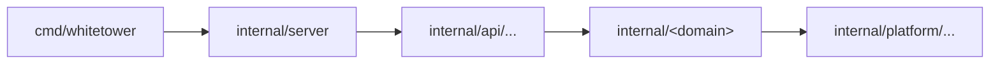

# Internals: package layout and rules

This page is for whoever changes the core: where code goes, the rules it follows, and how to test it. The rules marked **enforced** fail `golangci-lint`, and with it CI; the others are for review. The [development guide](../development.md) covers the tools and the everyday tasks.

## Package layout

Dependencies point one way: from the commands to the listeners, the APIs, the domain packages and the platform.



| Package | What it holds | May import |
| --- | --- | --- |
| `cmd/whitetower` | The server's commands; `serve` makes every dependency and hands it to what uses it | Everything |
| `internal/server` | The three listeners: TLS, HTTP/2, limits, the observer that logs, measures and traces every request, shutdown | The APIs, the console, the platform |
| `internal/api/rest` | The public REST API: the code generated from the OpenAPI document, its middleware, the problem details | Domain packages, the platform |
| `internal/api/moduleapi` | The module API of the module contracts, on ConnectRPC | Domain packages, the platform |
| `internal/webui` | The embedded console | The platform |
| `internal/<domain>` | The domain, from plan P1-02 on: the audit log, identities, the inventory, policies, the module registry, the kill switch | The platform |
| `internal/platform/...` | What every part shares: configuration, logging, metrics, tracing, the database, background jobs, notifications across replicas, the clock, the authentication hooks, rate limits, health, TLS | Other platform packages, `internal/version` |
| `internal/cli` | `wtctl` | The generated API client, the platform |
| `pkg/apiclient`, `pkg/moduleapi` | Generated code, public: the API client and the module API's types | |

## Rules

### Domain packages never import transport packages

**Enforced** (`depguard`, rule `domain`). A domain package does not import `internal/api`, `internal/server`, `internal/webui`, `internal/cli`, the wire types in `pkg/`, or ConnectRPC. Its types and errors are its own, and each API maps them to its wire format and its error codes, so that the domain is tested without HTTP and both APIs share it.

Below it, `internal/platform` imports nothing above it (rule `platform`).

### State changes run inside InTx, with their audit event

**Enforced in part** (`forbidigo`). A change of state runs in `db.InTx`, through the `Tx` it hands over:

- The change and its audit event commit together (AUD-01): `audit.Writer.Record` writes the event in the change's transaction, and its error, which the caller returns, rolls the change back.
- Notifications to the other replicas go in the transaction too: `notify.Bus.Publish` takes the `Tx`, once per transaction, never per row.
- Work outside the database that the change triggers runs in an `AfterCommit` hook, which only runs once the change is committed.
- Queries generated by `sqlc` that change state run on the `Tx`. Reads outside a transaction use `DB.Query` and `DB.QueryRow`.

Outside `internal/platform`, `DB.Exec` is refused, and only `internal/platform/db` opens connections. That the audit event is there, P1-02's tests check.

### Dependencies are wired in cmd/whitetower/main.go

**Enforced** (`depguard`, rule `wiring`, and `forbidigo`). `serve` makes every dependency and passes it to what uses it: no dependency injection framework, and no global state. No package registers with Prometheus's default registry, sets slog's default logger, serves through `http.DefaultServeMux` or sets OpenTelemetry's global providers. The one exception is `otel.SetErrorHandler` in `main`, the only way OpenTelemetry reports its own errors.

Package-level values that never change are fine: constants, lookup tables, compiled regular expressions, sentinel errors.

### Test helpers stay out of the server

**Enforced** (`depguard`, rule `test-helpers`). `resttest` authenticates whoever a request header names, and `dbtest` starts containers: only test files import the helpers of the next section.

### Conventions

- `context.Context` comes first. A request's IDs and its principal travel in it: `logging.WithRequest`, `logging.SetPrincipal`.
- Time comes from a `clock.Clock`, so that tests control it.
- Logs are slog JSON. What a client or a remote party chooses passes through `logging.Sanitize` once, where it enters. Secrets are `logging.Secret`, and headers are logged through `logging.Header`, which redacts credentials.
- Errors that reach a caller name nothing internal: the public API answers with the problem codes of the [errors reference](../reference/api-errors.md), the module API with ConnectRPC codes, and the cause goes to the log.
- Secrets are read from files only, named by settings ending in `_file`.
- Every setting has a field comment, from which the [configuration reference](../reference/configuration.md) is generated.
- SQL is written by hand, and `sqlc` generates its Go code. Migrations only move forward.
- Metrics start with `whitetower_`, and their labels never take a value that a client chooses.

## Writing tests

The test harness (plan P1-01, step 10):

| Helper | What it gives |
| --- | --- |
| `internal/platform/db/dbtest` | PostgreSQL in Docker: one container per test binary, and for each test a migrated database with the roles of a deployment. `OpenReplica` opens a pool as another replica would, `Terminate` ends sessions as a failure would, `Superuser` checks what the roles cannot see. Without Docker the tests skip, except in CI, where they fail |
| `internal/api/rest/resttest` | The public API, served for the test, and its generated client; `As` makes a call as a principal |
| `internal/platform/clock/clocktest` | A clock whose time moves only when the test moves it |
| `internal/platform/golden` | Comparison with files in `testdata`, which `-update` rewrites |
| `test/e2e` | The smoke test of a running deployment; CI runs it against the Compose stack |

A domain package's integration test takes a few lines. Once plan P1-04 adds the agents, for example:

```go
func TestRegisterAnAgent(t *testing.T) {
	pool := dbtest.New(t).Open(t)
	api := resttest.New(t, rest.Options{Inventory: inventory.New(pool)})
	resp, err := api.Client.RegisterAgentWithResponse(context.Background(), agent, resttest.As(owner))
	if err != nil || resp.StatusCode() != http.StatusCreated {
		t.Fatalf("%v %s", err, resp.Body)
	}
	golden.AssertJSON(t, "testdata/agent.json", resp.JSON201)
}
```

A test that implements an entry of the [security test catalog](../security/security-tests.md) names it in its comment: `// Security test ST-05: ...`. `test/security` checks that every automated entry of a finished plan has such a test.
