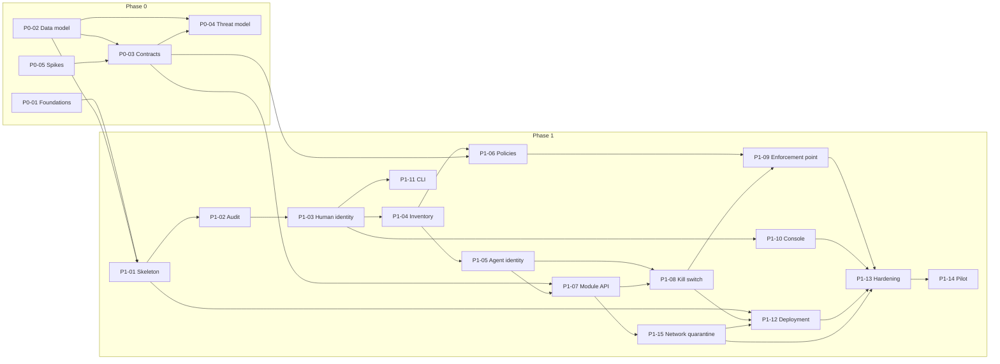

# Implementation plans to the MVP

These plans cover every step from an empty repository to the MVP: the end of Phase 1, when the pilot with real agents passes its gate. Each plan is one coherent work package that one engineer, or a small team, can pick up. Plans that are too large are split into subplans before work starts.

Read first: [requirements](../requirements/mvp-requirements.md), [architecture](../architecture/mvp-architecture.md), [ADRs](../adr/README.md). Sequencing, milestones and staffing are in the [roadmap](../roadmap.md).

## How the plans work

- **One file per plan**, under `phase-0/` and `phase-1/`, following the [template](_template.md).
- **IDs:** `P<phase>-<nn>`. Subplans take a suffix (`P1-10.1`) and live in a folder named after their plan (`phase-1/P1-10-web-console/`); the plan file then becomes the overview.
- **Steps marked "subplan candidate"** are the natural places to split.
- **Sizes**, for one engineer who knows the stack: **S** up to 1 week, **M** 1 to 3 weeks, **L** 3 to 6 weeks, **XL** more than 6 weeks.
- **Splitting rule:** an XL plan, or any step estimated at more than two weeks, is split into subplans before anyone starts it.
- **Status:** Draft → Ready (reviewed, dependencies met) → In progress → Done (acceptance criteria verified). The table below is the single place where status is tracked.
- **Plans are living documents.** When reality diverges, update the plan and say why. Decisions go to ADRs, contract changes to RFCs, requirement changes to the requirements document.

## Plans

### Phase 0: Foundations (gate G0, "Contracts v0.1 reviewed")

| ID | Plan | Size | Depends on | Main requirements | Status |
| --- | --- | --- | --- | --- | --- |
| [P0-01](phase-0/P0-01-engineering-foundations.md) | Engineering foundations | M | none | NFR-13, NFR-18, NFR-21, CON-01 | In progress |
| [P0-02](phase-0/P0-02-domain-and-data-model.md) | Domain and data model v0.1 | M | none | INV, AID-01, POL-01, AUD-01, NFR-19, NFR-20 | Done |
| [P0-03](phase-0/P0-03-module-contracts.md) | Module contracts v0.1 | L | P0-02, P0-05 (S1) | MOD-01 to MOD-05, MOD-08, POL-03, POL-05, POL-06 | Draft |
| [P0-04](phase-0/P0-04-threat-model.md) | Threat model v0.1 | M | P0-02, P0-03 (drafts) | NFR-21, NFR-22 | Draft |
| [P0-05](phase-0/P0-05-spikes-and-nfr-targets.md) | Technical spikes and NFR targets | M | none (uses `hack/spikes/`) | NFR-02 to NFR-09 | In progress |

### Phase 1: Core MVP (gate G1, "Pilot with real agents")

| ID | Plan | Size | Depends on | Main requirements | Status |
| --- | --- | --- | --- | --- | --- |
| [P1-01](phase-1/P1-01-core-platform-skeleton.md) | Core platform skeleton | M | P0-01, P0-02 | OPS-04, OPS-05, OPS-07 | Draft |
| [P1-02](phase-1/P1-02-audit-log.md) | Audit log | L | P1-01 | AUD-01 to AUD-10, NFR-08 to NFR-10 | Draft |
| [P1-03](phase-1/P1-03-human-identity-and-access.md) | Human identity and access | M | P1-01, P1-02 (writer) | HUM-01 to HUM-08 | Draft |
| [P1-04](phase-1/P1-04-inventory-and-lifecycle.md) | Inventory and lifecycle | L | P1-03 | INV-01 to INV-10 | Draft |
| [P1-05](phase-1/P1-05-agent-identity-and-credentials.md) | Agent identity and credentials | L | P1-04 | AID-01 to AID-09 | Draft |
| [P1-06](phase-1/P1-06-policy-model-and-distribution.md) | Policy model and distribution | L | P0-03, P1-04 | POL-01 to POL-10 | Draft |
| [P1-07](phase-1/P1-07-module-registry-and-api.md) | Module registry and module API | L | P0-03, P1-01, P1-05 | MOD-01 to MOD-05, MOD-07 | Draft |
| [P1-08](phase-1/P1-08-kill-switch.md) | Kill switch | L | P1-04, P1-05, P1-07 | KIL-01 to KIL-09 | Draft |
| [P1-09](phase-1/P1-09-python-enforcement-point.md) | White Tower enforcement point (Python) | L | P0-05 (S1), P1-06, P1-07, P1-08 | MOD-06 | Draft |
| [P1-10](phase-1/P1-10-web-console.md) | Web console | XL, split into 7 subplans | P1-10.0 needs only the requirements; P1-10.1 needs P1-03; then each backend plan | UI-01 to UI-09 | Draft |
| [P1-11](phase-1/P1-11-cli.md) | CLI (`wtctl`) | M | P1-03 | API-04 | Draft |
| [P1-12](phase-1/P1-12-packaging-and-deployment.md) | Packaging and deployment | XL, split into 2 parts | P1-01 (part 1); P1-07, P1-08 (part 2) | OPS-01 to OPS-07, NFR-14, NFR-15 | Draft |
| [P1-13](phase-1/P1-13-security-hardening-and-release.md) | Security hardening and release v0.1.0 | M | all feature plans | NFR-11, NFR-12, NFR-13 | Draft |
| [P1-14](phase-1/P1-14-pilot-and-gate.md) | Pilot and Phase 1 gate | M, plus pilot calendar | P1-13 | Charter success criteria | Draft |
| [P1-15](phase-1/P1-15-network-quarantine.md) | Kubernetes network quarantine module | M | P0-03, P1-05, P1-07; P1-08 for the end-to-end tests | KIL-10, NFR-23 | Draft |

## Dependencies

**Critical path** (with the baseline team of the [roadmap](../roadmap.md)): since the network quarantine joined the MVP, the platform track sets the end date: P0-01 → P1-01 → P1-02 → P1-07 → P1-11 → P1-15 → P1-12.2 → P1-13 → P1-14. The core domain track (P1-03 → P1-04 → P1-05 → P1-08 → P1-09) finishes one week earlier; with a fifth person taking P1-15, it becomes the critical path again. The contracts branch (P0-03 → P1-07) runs in parallel with slack. The console plans run in parallel and must keep pace, not lead.

## Definition of done (every plan)

- Code reviewed and merged; CI green.
- Unit and integration tests for new behavior, including negative tests for authorization and input validation.
- Contracts first: OpenAPI, protobuf and event schema changes are merged before or together with the code, and generated code is up to date.
- Every state change writes its audit events (AUD-01), and every new flow exposes metrics.
- Security checklist: permission matrix updated and tested, inputs validated, no secrets in logs, threat model updated if a trust boundary changed.
- Documentation updated: user, administrator and API documentation, configuration reference, and a runbook for anything an operator must do.
- Console strings externalized in English and Spanish when the console is touched.
- Changelog entry.

## Requirement coverage

Every Must requirement is covered by at least one plan:

| Area | Plans |
| --- | --- |
| Inventory and lifecycle (INV) | P0-02, P1-04, P1-10 |
| Human identity and access (HUM) | P1-03, P1-10, P1-11 |
| Agent identity and credentials (AID) | P1-05, P1-07 |
| Policies (POL) | P0-03, P1-06, P1-09 |
| Audit and evidence (AUD) | P0-02, P1-02, P1-11 |
| Kill switch (KIL) | P0-03, P1-08, P1-09, P1-10, P1-15 |
| Modules and contracts (MOD) | P0-03, P1-07, P1-09 |
| User interface (UI) | P1-10 |
| API and CLI (API) | P1-01, P1-11, and every feature plan for its endpoints |
| Operations (OPS) | P0-01, P1-01, P1-12 |
| Non-functional (NFR) | P0-05 sets targets; P1-13 and P1-14 verify them |
