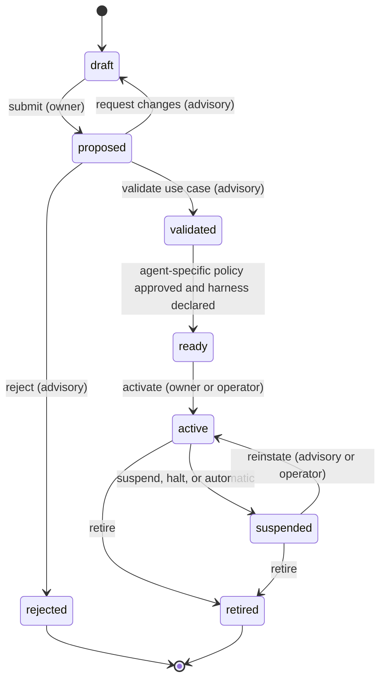

# White Tower: MVP requirements (Phases 0 and 1)

| | |
| --- | --- |
| **Status** | Draft v0.1, open for review |
| **Date** | 2026-09-28; updated 2026-09-29 (spike S1, ADR-0011, network quarantine) |
| **Sources** | [Project charter](../../Project%20Declaration.pdf), [README](../../README.md) |
| **Related** | [Architecture](../architecture/mvp-architecture.md), [ADRs](../adr/README.md), [Implementation plans](../plans/README.md) |

This document turns the project charter into verifiable requirements for the MVP. It defines what "MVP" means, what the system must do and how well, and what has to be settled before production code is written. Every implementation plan references the requirement IDs defined here.

Changes to this document go through pull requests. Changes to anything that is part of the module contracts go through the RFC process.

---

## 1. What the MVP is

The MVP is the end of **Phase 1 (Core MVP)** of the charter, and it includes all of **Phase 0 (Foundations)**. It is reached when the Phase 1 gate passes: **a pilot with real agents** in which:

1. Every pilot agent appears in the inventory with an active owner, a validated use case and an approved agent-specific policy.
2. Pilot agents authenticate with identities issued by White Tower and are governed at runtime by White Tower's enforcement point ([ADR-0011](../adr/0011-own-python-enforcement-point.md)), using policies distributed by White Tower.
3. Every policy decision and every governance action of the pilot is in the tamper-evident audit log, can be verified with the CLI, and is exported to at least one external system (SIEM or log collector).
4. The kill switch stops a running pilot agent, per agent and fleet-wide, within the target set in Phase 0, and the stop is confirmed and measured. Agents running on Kubernetes are also isolated at the network level while halted.

The following are **not** part of the MVP (they belong to Phases 2 and 3): LLM gateway and quotas, MCP gateway, skills repository, enforced harness/sandbox, shadow AI discovery, compliance module and the public third-party SDK. The MVP must not block them: the data model and the contracts account for them from v0.1 (see [section 9](#9-out-of-scope-for-the-mvp)).

## 2. Actors

### 2.1 Human roles

| Role | Source | Responsibility | Main MVP interactions |
| --- | --- | --- | --- |
| AI steering committee | Charter | Approves global policies and accepted providers and jurisdictions | Approve global policies; halt the fleet |
| AI advisory committee (incl. security) | Charter | Validates use cases and reviews each agent's specific policy | Validate use cases; approve agent-specific policies; suspend and reinstate agents |
| Agent owner | Charter | Accountable for the agent's behavior, resources and periodic reviews | Propose agents; register credentials; activate; complete reviews; halt own agents |
| User | Charter | Uses authorized agents within the scope their policy allows | Read the catalog of active agents (runtime use arrives with the gateways in Phase 2) |
| Platform operator | Charter | Runs modules and integrations; can trigger the kill switch | Register modules; activate agents; halt agents and the fleet |
| Auditor | New | Read-only access to inventory, policies and audit evidence | Search, verify and export the audit log |
| Platform administrator | New | Manages role mappings, settings and break-glass custody | Configure the platform; holds no approval rights by default |

### 2.2 System actors

| Actor | Description |
| --- | --- |
| Agent | An in-house or third-party AI agent. It may run with or without White Tower runtime integration (see coverage levels). |
| Module | A component that provides a capability through the module contract. It runs as one or more module instances. In the MVP: the enforcement point, the network quarantine module and the mock module. |
| Enforcement point (EP) | A module instance that applies governance to agents at runtime. In the MVP, this is White Tower's enforcement point, a Python package loaded in the agent's process ([ADR-0011](../adr/0011-own-python-enforcement-point.md)). |
| Organization IdP | Source of human identities (OIDC). |
| SIEM or log collector | Consumer of audit exports. |

## 3. Glossary

| Term | Meaning |
| --- | --- |
| Adapter | Code that translates a product's API (for example Microsoft AGT) into the White Tower module contract. |
| Capability | A function a module declares in its manifest, for example `policy-engine` or `runtime-control`. |
| Coverage level | How deeply an agent is governed. **C0 Declared**: in the inventory with owner, use case and policy, no runtime integration. **C1 Identified**: authenticates with White Tower credentials. **C2 Governed**: an EP enforces White Tower policies and reports decisions to the audit log. **C3 Stoppable**: a halt or kill-switch drill on this agent was confirmed within the configured period (default 90 days). |
| Effective policy set | The global policies plus the agent-specific policies that apply to one agent, distributed as a signed **policy bundle**. |
| Governance state | What the core tells EPs about an agent: lifecycle state, run state (running or halted), effective bundle reference and lease. |
| Halt | The action of the kill switch: stop an agent (or the fleet) that is running. |
| Lease | A time-bounded permission to keep operating that an EP must renew with the core. When it expires, the EP fails closed. |
| Network quarantine | Isolation of a halted agent's workloads at the network level, applied from outside the agent's process (KIL-10). |
| Lifecycle state | Where an agent is in the governance process (draft, proposed, validated, ready, active, suspended, retired, rejected). |
| Run state | Whether an agent is allowed to act right now (running) or stopped by the kill switch (halted). Orthogonal to the lifecycle state. |
| Checkpoint | A signed statement of the size and root hash of the audit log at a point in time. |

## 4. Priorities

- **M (Must):** blocks the MVP gate.
- **S (Should):** MVP target; it may move to Phase 2 only through an explicit, recorded decision.
- **C (Could):** desirable; done only if it does not put a Must or Should at risk.

The **Source** column says where a requirement comes from: a charter section, or **New** when it is derived by this document and therefore needs extra scrutiny in review.

## 5. Functional requirements

### 5.1 Inventory and lifecycle (INV)

| ID | Requirement | Pri | Source |
| --- | --- | --- | --- |
| INV-01 | The system shall register agents, in-house or third-party, with mandatory metadata: name, description, kind (in-house or third-party), vendor or framework, deployment location, environments, risk tier, data categories accessed and owner. | M | Scope |
| INV-02 | Every agent shall have exactly one accountable owner who is an active human principal, and may have delegates. Ownership transfers are recorded. | M | Principles |
| INV-03 | Every agent shall be linked to a use case, validated by the advisory committee before the agent can be activated. | M | Governance model |
| INV-04 | The system shall enforce the agent lifecycle state machine (5.1.1) with guarded transitions, role checks and separation of duties. Every transition is audited. | M | Governance model |
| INV-05 | The system shall automatically suspend an agent whose owner is no longer active, or whose periodic review is overdue beyond a grace period. | M | Governance model |
| INV-06 | The system shall schedule periodic reviews for each agent, with an interval that depends on the risk tier, and remind owners before a review is due. | M | Governance model |
| INV-07 | Third-party agents without runtime integration (for example SaaS agents) shall be registrable at coverage level C0, so that the inventory is complete even where enforcement is not possible. | M | Scope |
| INV-08 | The system shall compute and show each agent's coverage level (C0 to C3). | S | New |
| INV-09 | The inventory shall be searchable, filterable (state, owner, risk tier, environment, coverage, labels) and exportable as CSV and JSON. | S | New |
| INV-10 | Agents can be imported in bulk from a declarative YAML file to onboard existing fleets. | C | New |

#### 5.1.1 Agent lifecycle (initial proposal, refined in plan P0-02)

The charter's lifecycle (proposal → use case validation → policy and harness assignment → deployment → monitored operation → periodic review → retirement) maps to these states:

- **Periodic review** is a process, not a state: an active agent stays active while it is being reviewed. An overdue review past its grace period triggers automatic suspension (INV-05).
- **Suspension** can also apply to `validated` and `ready` agents (for example when the owner leaves). Reinstating returns the agent to the state it had when it was suspended.
- Agents in `draft`, `validated` or `ready` can be retired directly.
- The **run state** (running or halted) is separate: a halt can hit any agent that has running instances, whatever its lifecycle state. A halt of one agent also moves it to `suspended`; a fleet halt does not change lifecycle states (KIL-06).
- **Invariant:** an `active` agent always has an active owner, a validated use case and at least one approved agent-specific policy.
- The **harness** is declared in the MVP (a descriptive record assigned during "policy and harness assignment"); enforcing it arrives with the harness module in Phase 2.

### 5.2 Human identity and access (HUM)

| ID | Requirement | Pri | Source |
| --- | --- | --- | --- |
| HUM-01 | Humans authenticate only through the organization's IdP using OIDC (authorization code with PKCE). White Tower stores no human passwords. | M | Non-functional requirements |
| HUM-02 | Roles are derived from IdP group claims through a configurable mapping; the platform administrator can also grant role bindings inside White Tower. | M | Non-functional requirements |
| HUM-03 | Authorization is deny-by-default on every API operation and follows the permission matrix (5.2.1). | M | Principles |
| HUM-04 | Separation of duties: nobody approves their own proposal, use case or policy version, and releasing a halt needs a second person. | M | New |
| HUM-05 | Principal status is kept current: administrators can deactivate principals (M), and the system accepts deprovisioning from the IdP through SCIM 2.0 Users (S). | M/S | Governance model |
| HUM-06 | Break-glass: a sealed emergency credential allows halting agents and the fleet while the IdP is unavailable. Every use raises a critical audit event. | S | New |
| HUM-07 | Service accounts and personal access tokens for automation, with scopes and expiry. | S | New |
| HUM-08 | SAML IdPs are supported through an OIDC broker (for example Keycloak), with documented setup. Native SAML is a Phase 2 candidate. | S | Non-functional requirements |

#### 5.2.1 Permission matrix (initial, refined in plan P1-03)

`own` means only for agents the person owns or is a delegate for. Every approval excludes the author (HUM-04).

| Action | Steering | Advisory | Owner | User | Operator | Auditor | Admin |
| --- | :-: | :-: | :-: | :-: | :-: | :-: | :-: |
| View inventory | ✔ | ✔ | ✔ | active only | ✔ | ✔ | ✔ |
| Propose an agent (becomes its owner) | | | ✔ | | | | |
| Edit agent metadata | | | own | | ✔ | | |
| Validate or reject a use case | | ✔ | | | | | |
| Author a global policy | ✔ | ✔ | | | | | |
| Approve a global policy | ✔ | | | | | | |
| Author an agent-specific policy | | ✔ | own | | | | |
| Approve an agent-specific policy | | ✔ | | | | | |
| Activate an agent | | | own | | ✔ | | |
| Complete a periodic review | | sign-off (high and critical risk) | own | | | | |
| Suspend an agent | | ✔ | own | | ✔ | | |
| Reinstate or retire an agent | | ✔ | retire own | | ✔ | | |
| Manage agent credentials | | | own | | ✔ | | |
| Halt an agent | ✔ | ✔ | own | | ✔ | | |
| Halt the fleet | ✔ | | | | ✔ | | |
| Request or approve a halt release (two different people; a fleet release is approved by steering or an operator) | ✔ | ✔ | request own | | ✔ | | |
| Register and manage modules | | | | | ✔ | | |
| View the audit log | ✔ | ✔ | own | | ✔ | ✔ | |
| Verify and export audit evidence | ✔ | ✔ | | | ✔ | ✔ | |
| Manage role mappings and settings | | | | | | | ✔ |

### 5.3 Agent identity and credentials (AID)

| ID | Requirement | Pri | Source |
| --- | --- | --- | --- |
| AID-01 | Every agent has a unique, stable identifier and a SPIFFE-format identity (`spiffe://<trust-domain>/agent/<agent-id>`). | M | Scope, standards |
| AID-02 | Agents authenticate with asymmetric credentials (`private_key_jwt`, RFC 7523). White Tower never holds an agent's private key. | M | New |
| AID-03 | White Tower issues short-lived access tokens (JWT, RFC 9068; 5 minutes by default, 15 at most) through an OAuth 2.0 token endpoint, and publishes its signing keys (JWKS) and metadata (RFC 8414). | M | Scope |
| AID-04 | Token issuance is gated by governance state: never for halted, suspended or retired agents; production credentials only for `active` agents; non-production credentials from `validated` onward. | M | Principles |
| AID-05 | Credentials can be rotated and revoked; halting or retiring an agent blocks new tokens immediately. | M | Scope |
| AID-06 | Module instances authenticate with the same mechanism and their own identities (`spiffe://<trust-domain>/module/<module-id>`). | M | New |
| AID-07 | Kubernetes workload identity federation: projected service account tokens from registered clusters are accepted instead of static keys. | S | New |
| AID-08 | Per-task delegated tokens through OAuth 2.0 Token Exchange (RFC 8693), carrying the on-behalf-of user and a narrowed scope. Must in Phase 2, when the gateways consume them. | C | Scope |
| AID-09 | SPIFFE/SPIRE SVIDs are accepted as agent credentials. | C | Standards |

### 5.4 Policies (POL)

| ID | Requirement | Pri | Source |
| --- | --- | --- | --- |
| POL-01 | Policies are stored as immutable, versioned documents with a declared language (Cedar in the MVP; Rego for engines that run it natively) and a scope: global or agent-specific. | M | Scope |
| POL-02 | Approval workflow: global policies are approved by the steering committee and agent-specific policies by the advisory committee; the author cannot approve. | M | Governance model |
| POL-03 | The combination semantics (5.4.1) are part of the contract, and every policy engine adapter must pass the conformance tests for them. | M | Principles |
| POL-04 | An agent cannot become active without at least one approved agent-specific policy. | M | Governance model |
| POL-05 | The effective policy set of each agent is distributed to enforcement points as a signed, versioned bundle. EPs report which bundle is active, so drift is visible. | M | Scope |
| POL-06 | The decision input model (subject, action, resource, context, aligned with OpenID AuthZEN) is published and versioned as part of the contracts. | M | Standards |
| POL-07 | Policies are validated (syntax, plus tests when provided) before they can be submitted for approval. | S | New |
| POL-08 | Versions can be compared (diff) and rolled back; a rollback approves an earlier content as a new version. | S | New |
| POL-09 | Dry run of a policy version against recorded or hand-written requests. | C | New |
| POL-10 | Catalog of accepted providers and jurisdictions, approved by the steering committee and referenceable from policies. Must in Phase 2, with the LLM gateway. | C | Governance model |

#### 5.4.1 Combination semantics (deny-overrides, default deny)

For every decision request, the engine evaluates the applicable global policies and the agent-specific policies of the requesting agent:

1. If any applicable policy, global or agent-specific, returns **deny**, the decision is **deny**. Agent-specific policies cannot override a global deny.
2. Otherwise, if at least one applicable policy returns **allow**, the decision is **allow**.
3. Otherwise the decision is **deny** (default deny).
4. Any error, timeout, missing or unverifiable bundle, unknown agent, expired lease or halted run state results in **deny**.

The decision records the policy versions and rules that produced it, so the audit log can explain every allow and every deny.

### 5.5 Audit and evidence (AUD)

| ID | Requirement | Pri | Source |
| --- | --- | --- | --- |
| AUD-01 | Every state change in the core (who, what, when, why, before and after) writes an audit event in the same database transaction as the change. | M | Principles |
| AUD-02 | Enforcement points report every policy decision and governed action. Ingestion is idempotent and at-least-once, with per-source sequence numbers so gaps are detected. | M | Principles |
| AUD-03 | The log is append-only and tamper-evident: events are sealed into a Merkle tree and signed checkpoints are produced periodically. | M | Non-functional requirements |
| AUD-04 | Verification tooling detects any modification, deletion, insertion or reordering of sealed events, validates checkpoint signatures, proves the inclusion of a single event and proves consistency against a checkpoint held outside White Tower. | M | Non-functional requirements |
| AUD-05 | Audit events can be searched and filtered (time, agent, actor, type, decision) through the API and the UI. | M | Scope |
| AUD-06 | Continuous export to external systems as OpenTelemetry logs (OTLP) and JSON Lines, including the signed checkpoints. | M | Non-functional requirements, success criteria |
| AUD-07 | Syslog export (RFC 5424 over TLS). | S | Non-functional requirements |
| AUD-08 | Configurable retention (at least six months by default) that keeps the remaining log verifiable (S); archival to WORM storage compatible with S3 Object Lock (C). | S/C | Non-functional requirements |
| AUD-09 | Reads of the audit log are themselves audited. | S | New |
| AUD-10 | Export of a self-verifiable evidence bundle (events, checkpoints and proofs) for a time range. | C | Scope |

### 5.6 Kill switch (KIL)

| ID | Requirement | Pri | Source |
| --- | --- | --- | --- |
| KIL-01 | Halting an agent stops it while it runs. **Guaranteed:** from the moment the enforcement point receives the halt, every further governed call and interaction (tool calls, model calls, inputs and outputs) is denied; revoking the next token is not enough. **Best effort:** the action already in flight is interrupted when the framework allows it, and the acknowledgement reports whether it was. Terminating the agent's process is not the default: it happens only when the agent's owner chooses the `terminate` halt mode (decision of 2026-09-29, after spike S1). | M | Non-functional requirements |
| KIL-02 | Fleet-wide halt of all agents (M), or of a selector such as environment, label or risk tier (S). | M/S | Scope |
| KIL-03 | Every enforcement point of the target acknowledges the halt. The API and UI show per-instance status and the propagation time, which is also exported as a metric. | M | Non-functional requirements |
| KIL-04 | Fail-closed backstop: an enforcement point that loses contact with the core for longer than its lease TTL denies every action and halts the agent. | M | Principles |
| KIL-05 | Halting is available from the UI, the API and the CLI, requires a reason and takes effect without approval. Releasing a halt requires two different authorized people. | M | Governance model |
| KIL-06 | Halting an agent blocks its token issuance and moves it to `suspended` with the halt as reason. A fleet or selector halt blocks token issuance for every matching agent but leaves lifecycle states unchanged, so releasing it restores operation without reinstating agents one by one. | M | New |
| KIL-07 | An enforcement point that connects or reconnects for a halted agent receives the halted state before it can allow any action. | M | New |
| KIL-08 | Break-glass halting works while the IdP is unavailable (see HUM-06). | S | New |
| KIL-09 | Kill-switch drills: test halts on designated agents, with measured timings. A successful drill within the configured period gives the agent coverage C3. | S | Success criteria |
| KIL-10 | **Network quarantine on Kubernetes.** While an agent is halted, by an agent, selector or fleet halt, its workloads on Kubernetes are isolated at the network level, whatever the agent's code does: all traffic is denied except what the halt itself needs (reaching the core). Workloads started later for a halted agent are isolated from their start. The isolation is applied within seconds (NFR-23), reported as its own layer in the halt acknowledgement, and lifted when the halt is released. The workload keeps running, so it can be investigated. It requires a CNI that enforces deny rules, such as Cilium, Calico, Antrea or one implementing AdminNetworkPolicy (decision of 2026-09-29). | M | Principles (deny by default), New |

### 5.7 Modules and contracts (MOD)

| ID | Requirement | Pri | Source |
| --- | --- | --- | --- |
| MOD-01 | Each module declares a manifest: capabilities, supported contract versions, events emitted and consumed, endpoints, required permissions and a configuration schema. Manifests are validated against a published JSON Schema. | M | Architecture |
| MOD-02 | Registering a module requires operator approval. Instances authenticate, send heartbeats and report health and version, and the UI shows them. | M | New |
| MOD-03 | Contracts are versioned (`v1alpha1` in the MVP), versions are negotiated when a module connects, and CI detects breaking changes. Contract changes go through the RFC process. | M | Charter governance |
| MOD-04 | Governance state is delivered to enforcement points through a watch stream with leases (ADR-0005). | M | Non-functional requirements |
| MOD-05 | A conformance kit lets module authors check an implementation against the contract, including leases, fail-closed behavior, halts, combination semantics and event schemas. | M | Scope |
| MOD-06 | White Tower's enforcement point for Python agents provides the governance gate, policy enforcement with Cedar, runtime control (halt) and decision and action events. It is a Python package loaded inside the agent's process, with hooks for the pilot's frameworks (LangGraph 1.x first). It fails closed, records every decision before acting on it, and reports honestly what each halt layer achieved. It replaces the Microsoft AGT adapter of the charter's Phase 1 ([ADR-0011](../adr/0011-own-python-enforcement-point.md)); an AGT interoperability adapter is a Phase 2 candidate. | M | Roadmap (Phase 1), ADR-0011 |
| MOD-07 | A mock reference module is available for tests and demos. | M | New |
| MOD-08 | Replacing a module implementation requires no change in the core. The MVP designs for it; Phase 2 demonstrates it with a second policy engine. | M | Success criteria |

### 5.8 User interface (UI)

| ID | Requirement | Pri | Source |
| --- | --- | --- | --- |
| UI-01 | Web console with SSO; navigation and actions adapt to the user's roles. | M | Scope |
| UI-02 | Inventory: list with filters, and agent detail (owner, use case, state and history, policies, credentials, instances, coverage, recent audit events). | M | Scope |
| UI-03 | Workflows: propose an agent, validate or reject a use case, submit and approve policies, activate, review, suspend and reinstate, retire. | M | Governance model |
| UI-04 | Policies: list, versions, diff, editor with syntax highlighting, approvals. | M | Scope |
| UI-05 | Audit explorer with filters, event detail and verification status. | M | Scope |
| UI-06 | Kill switch console: halt an agent or the fleet with confirmation and reason, follow propagation live, and release with a second approval. | M | Scope |
| UI-07 | Modules and instances: health, versions, contract versions and active bundle versions. | M | Scope |
| UI-08 | Home dashboard: agents by state, overdue reviews, coverage, active halts, module health. | S | New |
| UI-09 | Personal inbox with pending approvals and reviews due. | S | New |

### 5.9 API and CLI (API)

| ID | Requirement | Pri | Source |
| --- | --- | --- | --- |
| API-01 | Every UI function is available through the public REST API; the UI uses no private endpoints. | M | Scope |
| API-02 | The public API is described by an OpenAPI 3.1 document, versioned under `/api/v1`, and CI rejects unintended breaking changes. | M | Scope |
| API-03 | Errors use RFC 9457 problem details, list endpoints paginate, and updates use optimistic concurrency (ETag and If-Match). | M | New |
| API-04 | The `wtctl` CLI covers login, agents, credentials, policies, halts, audit verification and export, and modules. | M | New |
| API-05 | Outgoing webhooks for selected events (review due, halt issued, agent suspended). | C | New |

### 5.10 Operations (OPS)

| ID | Requirement | Pri | Source |
| --- | --- | --- | --- |
| OPS-01 | Container images for linux/amd64 and linux/arm64, and a Docker Compose setup for evaluation and development. | M | Non-functional requirements |
| OPS-02 | Helm chart for Kubernetes, with at least two core replicas and an external PostgreSQL. | M | Non-functional requirements |
| OPS-03 | Air-gapped installation from an offline bundle (images, chart, SBOMs, signatures and documentation). | S | Non-functional requirements |
| OPS-04 | Configuration through a file and environment variables; secrets read from files or Kubernetes Secrets; a documented configuration reference. | M | New |
| OPS-05 | Self-observability: Prometheus metrics, optional OTLP export of traces and logs, structured JSON logs, liveness and readiness endpoints. | M | Principles (OpenTelemetry) |
| OPS-06 | Backup and restore procedure for PostgreSQL and signing keys, documented and tested at least once. | S | New |
| OPS-07 | Database migrations run automatically and are forward-only; the upgrade procedure is documented. | M | New |

## 6. Non-functional requirements

The charter leaves the decision latency and kill switch targets "to be set in phase 0". The values below are **proposed starting targets**; plan P0-05 measures them and this table is updated at the Phase 0 gate.

| ID | Requirement | Proposed target | Pri | Set or verified by |
| --- | --- | --- | --- | --- |
| NFR-01 | **Fail-closed.** EPs deny every action when the lease has expired, the bundle is missing, invalid or unsigned, the agent state is unknown or the agent is halted. The core API denies on any authorization error. | 100% of fault-injection tests | M | P0-03, P1-08 |
| NFR-02 | **Decision latency.** The core is never in the synchronous path of an agent action; policy evaluation at the EP adds bounded latency. | p99 ≤ 5 ms in-process; p99 ≤ 20 ms for a remote PDP in the same cluster. Measured in spikes S1 and S4, with 100 policies: in-process p99 ≤ 0.12 ms in Go (`cedar-go`), ≤ 1.02 ms in Python (`cedarpy`), ≤ 1.2 ms with OPA embedded; ≤ 0.53 ms through an AuthZEN decision point on the same host. The durable evidence write before each action is measured in P1-09 | M | P0-05 |
| NFR-03 | **Halt propagation to connected EPs**, from halt issued to acknowledgement. | p95 ≤ 2 s; max ≤ 5 s at MVP scale. Measured in spike S2 with 1,000 EPs on two replicas: fleet halts p95 0.63 s, max 0.74 s; agent halts max 19 ms | M | P0-05, P1-08 |
| NFR-04 | **Halt effect.** No new governed action can start once the EP has received the halt (within the NFR-03 time). Interrupting the action in flight is best effort and always reported; the process is terminated only in the `terminate` halt mode. | Gate closed within milliseconds of receipt (spike S1: under 0.02 ms). In-flight asynchronous work interrupted: p95 ≤ 10 s (S1: 1 to 3 ms); blocking work reported as not interrupted unless the halt mode is `terminate` | M | P0-05, P1-09 |
| NFR-05 | **Lease backstop.** An EP without contact with the core halts within its lease TTL. | Default TTL 60 s; configurable 10 to 300 s, per risk tier (60, 60, 30 and 15 s for low, medium, high and critical). Measured in spike S2: expiry within 10 ms of the TTL | M | P0-05 |
| NFR-06 | **Availability.** Core highly available with at least two replicas; rolling upgrades complete well within the lease TTL, so they do not stop agents. | 99.9% monthly during the pilot. Spike S2: a lost replica's enforcement points move to the other one in 0.6 s, with no lease expiry | S | P1-12 |
| NFR-07 | **Scale.** Capacity the MVP must sustain. | 1,000 agents; 500 concurrent EP connections; 200 audit events/s sustained and 2,000/s bursts for 60 s; 50 concurrent console users. Spike S2 ran 1,000 EP connections on two replicas: about 50 KiB of live heap per stream and 3 to 4% of a core per replica while idle | M | P0-05, P1-13 |
| NFR-08 | **Audit durability.** No acknowledged audit event is lost; EPs buffer events durably while the core is unreachable. | RPO 0 for acknowledged events; EP buffer ≥ 24 h at 10 events/s | M | P1-02, P1-09 |
| NFR-09 | **Audit sealing.** Delay between ingestion and sealing, and checkpoint frequency. | Sealed ≤ 5 s after ingestion; a checkpoint at least every 60 s | M | P1-02 |
| NFR-10 | **Audit retention.** Default online retention, aligned with the EU AI Act minimum for logs of high-risk systems (Articles 19 and 26 require at least six months). | ≥ 6 months, configurable | M | P1-02 |
| NFR-11 | **API performance.** Read latency of the public API at MVP scale. | p95 ≤ 300 ms | S | P1-13 |
| NFR-12 | **Security baseline.** Web UI and API meet OWASP ASVS 5.0 level 2; TLS 1.2 or later (1.3 preferred) on every listener; secure session cookies; strict Content Security Policy; no secrets in logs. | ASVS L2 checklist passed before the pilot | M | P1-13 |
| NFR-13 | **Supply chain.** Signed artifacts (cosign), SBOMs (SPDX and CycloneDX), build provenance (SLSA Build L3 as target), pinned dependencies, vulnerability scanning. | No known critical or high vulnerabilities at release | M | P0-01, P1-13 |
| NFR-14 | **Air-gap.** No outbound connection unless configured: no telemetry, no update checks, no CDNs; every UI asset is served locally. | Egress-denied end-to-end test passes | M | P1-12 |
| NFR-15 | **Portability.** linux/amd64 and linux/arm64; the three latest Kubernetes minor versions; PostgreSQL 16 or later. | CI matrix green | M | P1-12 |
| NFR-16 | **Operability.** Runbooks for halting, key rotation, backup and restore, and upgrades. | Runbooks reviewed and rehearsed once | S | P1-12, P1-13 |
| NFR-17 | **Accessibility and localization.** WCAG 2.2 AA; every UI string externalized; English and Spanish at MVP. | Automated axe checks in CI plus manual review | S | P1-10 |
| NFR-18 | **Maintainability.** CI under 15 minutes; ≥ 70% test coverage in core domain packages; contract changes pass breaking-change checks; every public API documented. | CI gates | S | P0-01 |
| NFR-19 | **Time.** UTC RFC 3339 timestamps with milliseconds; the server assigns the ingestion time and keeps the source time; hosts are NTP-synchronized. | Documented and tested | M | P0-02 |
| NFR-20 | **Privacy.** Personal data in audit events is minimized, human identifiers can be pseudonymized on export, and retention is configurable (GDPR). | Data inventory reviewed | S | P0-02, P0-04 |
| NFR-21 | **Security of the project itself.** Published threat model, updated each phase; SECURITY.md with coordinated vulnerability disclosure; private vulnerability reporting enabled. | Published at the Phase 0 gate | M | P0-01, P0-04 |
| NFR-22 | **Framework mapping.** Features mapped to the OWASP Top 10 for Agentic Applications 2026 (ASI01 to ASI10) and to the EU AI Act obligations on logging (Article 12), human oversight including the ability to halt the system (Article 14(4)(e)), and log retention and monitoring (Articles 19 and 26). | Mapping document | S | P0-04 |
| NFR-23 | **Network quarantine.** Time from a halt issued to the agent's workloads isolated, on the reference CNI (Cilium), for workloads running when the halt is issued. | p95 ≤ 5 s; max ≤ 10 s | S | P1-15 |

## 7. Constraints

| ID | Constraint | Source |
| --- | --- | --- |
| CON-01 | License Apache-2.0 (the LICENSE file already contains it). | Charter, [ADR-0008](../adr/0008-license-apache-2.md) |
| CON-02 | Self-hosted, with no mandatory cloud service and no outbound telemetry. | Principles |
| CON-03 | Standards over custom formats: OpenTelemetry, OPA/Rego or Cedar, MCP, OIDC and SPIFFE. | Principles |
| CON-04 | Deployable on containers and Kubernetes, suitable for environments without Internet access. | Non-functional requirements |
| CON-05 | The core is limited to five functions (inventory, agent identity, policy model, audit and kill switch); everything else is a module. | Principles, risks |
| CON-06 | Backend in Go, frontend in TypeScript with React. | [ADR-0001](../adr/0001-backend-language-go.md), [ADR-0002](../adr/0002-frontend-typescript-react.md) |
| CON-07 | PostgreSQL is the only stateful dependency of the MVP core. | [ADR-0003](../adr/0003-postgresql-only-stateful-dependency.md) |

## 8. Assumptions and dependencies

| ID | Assumption | Impact if false |
| --- | --- | --- |
| ASM-01 | The pilot's governed agents are Python agents whose tool and model calls can be hooked, starting with LangGraph 1.x. This replaces the charter's assumption that Microsoft AGT would be the first enforcement point: spike S1 found it immature (Public Preview, frequent breaking changes, no foundation after the Agentic AI Foundation declined it in June 2026), and the MVP no longer depends on it ([ADR-0011](../adr/0011-own-python-enforcement-point.md)). | The enforcement point needs hooks for another framework (P1-09), or an agent is registered at coverage C0 or C1 without runtime enforcement. |
| ASM-02 | There is an initial team able to build the core (charter assumption). Plan sizes assume one engineer per plan. | Dates move; scope does not. |
| ASM-03 | A pilot organization provides an OIDC IdP (or accepts the bundled Keycloak), a Kubernetes cluster or a Docker host, two to five real agents that can be instrumented with White Tower's enforcement point, named owners and committee members, and a SIEM or log collector. | The Phase 1 gate cannot be passed. Securing the pilot early is on the critical path. |
| ASM-04 | Hosts are time-synchronized (NTP). | Audit timestamps and token validation become unreliable. |
| ASM-05 | Kubernetes clusters that run governed agents use a CNI that enforces deny rules (Cilium, Calico, Antrea, or one implementing AdminNetworkPolicy), and agents' pods can be labeled with their White Tower agent ID. | Network quarantine (KIL-10) is not available in that cluster: halts there rely on the in-process gate and on token issuance, and the console shows the quarantine layer as unavailable. It is demonstrated on the reference cluster instead. |

## 9. Out of scope for the MVP

| Capability | Phase | What the MVP does to prepare |
| --- | --- | --- |
| LLM gateway, token quotas, cost, GPU and local inference | 2 | Capability defined in the contract taxonomy; decision input model covers model calls |
| MCP and tool gateway | 2 | Decision input model covers tool calls; agent tokens carry an audience |
| Skills repository with review and signing | 2 | Capability defined in the taxonomy; the audit log and signing keys are reusable |
| Enforced per-agent harness (sandbox), including stopping workloads | 2 | Harness declared per agent during the lifecycle; halted agents on Kubernetes are already isolated at the network level (KIL-10) |
| Per-task delegated credentials (token exchange) | 2 | Token endpoint designed to add the grant (AID-08) |
| Second policy engine (module replacement demonstrated) | 2 | Contracts validated on paper against more than one engine (P0-03) |
| Microsoft AGT interoperability adapter | 2 | Contracts mapped onto AGT (P0-03); AGT re-tested live in the pilot (P1-14, ADR-0011) |
| Shadow AI discovery | 3 | Inventory accepts C0 agents and a `discovered` source flag is reserved |
| Compliance module and GRC export | 3 | Evidence bundles (AUD-10) and framework mapping (NFR-22) |
| Public third-party module SDK | 3 | Internal Go SDK and conformance kit built in the MVP |
| Multi-tenancy | Not planned | Single organization per deployment (decision in P0-02) |
| Hardware security modules and cloud KMS | 2 or later | Key access behind an interface |

## 10. What we need first

These must exist before feature code starts. They are the Phase 0 plans and the first steps of Phase 1.

1. **Accepted decisions.** ADR-0001 to ADR-0010 accepted or amended by the maintainers. ADR-0011 is already accepted.
2. **Phase 0 outputs.** Data model v0.1 (P0-02), module contracts v0.1 reviewed through an RFC (P0-03), threat model v0.1 (P0-04), and the NFR targets of section 6 confirmed by measurements (P0-05).
3. **Project infrastructure.** Repository settings (branch protection, required reviews, private vulnerability reporting, secret scanning), CI, container registry, and the Go module path decision, which depends on whether the project will own a domain (P0-01).
4. **People.** Maintainers, reviewers for contract RFCs and a security reviewer. A **pilot organization and its agents identified by the Phase 0 gate**, because the Phase 1 gate depends on them (ASM-03).
5. **Environments.** Local development with Docker Compose, a disposable Kubernetes cluster in CI (kind or k3d), and the pilot environment.

## 11. Traceability to the charter's success criteria

| Success criterion | Requirements | Verified in |
| --- | --- | --- |
| Every deployed agent appears in the inventory with an assigned owner and policy | INV-01, INV-02, INV-04, POL-04, AID-04 | P1-14 |
| The kill switch stops a running agent within the target set in Phase 0 | KIL-01 to KIL-07, KIL-10, NFR-03 to NFR-05, NFR-23 | P0-05 (target), P1-08, P1-09, P1-15, P1-14 |
| At least one module is replaced by another vendor's module without changes to the core | MOD-03, MOD-05, MOD-08 | Designed in P0-03, demonstrated in Phase 2 |
| Audit evidence is consumed from an external SIEM | AUD-03, AUD-04, AUD-06 | P1-02, P1-14 |

## 12. Open questions

| # | Question | Proposal | Decided in |
| --- | --- | --- | --- |
| Q1 | What exactly does "if the core does not respond, the action is denied" mean? | Leases with a TTL: EPs decide locally and fail closed when the lease expires (ADR-0005). A synchronous check per action is a Phase 2 option for critical agents. | ADR-0005, Phase 0 gate |
| Q2 | Is an agent in several environments one record or several? | **Decided (P0-02):** one logical agent; credentials labeled per environment; running instances reported by EPs. See the [domain model](../architecture/domain-model.md#1-modeling-decisions). | P0-02 |
| Q3 | Single-tenant or multi-tenant? | **Decided (P0-02):** single organization per deployment, no tenant column. | P0-02 |
| Q4 | Default lease TTL and halt targets? | Section 6 values, adjusted with the spike measurements. | P0-05 |
| Q5 | Which policy languages does the MVP support? | **Cedar as the primary language:** its semantics ("forbid overrides permit", default deny) are exactly POL-03, it is a standard named in the charter, and the official Go implementation lets the core validate and simulate policies. Rego as the second language. **Spike S1 confirmed:** Cedar runs in-process in Python (`cedarpy`) with exactly these semantics; Rego does not (it needs the `opa` binary or a server). Cedar is primary; Rego stays for engines that run it natively. See [S1](../spikes/S1-agt.md). | P0-05, P0-03 |
| Q6 | Go module path and domain? | A vanity path if the project gets a domain, to survive a move to a foundation. | P0-01 |
| Q7 | Who is the pilot organization, and which agents take part? | To be secured before the Phase 0 gate. | Maintainers |
