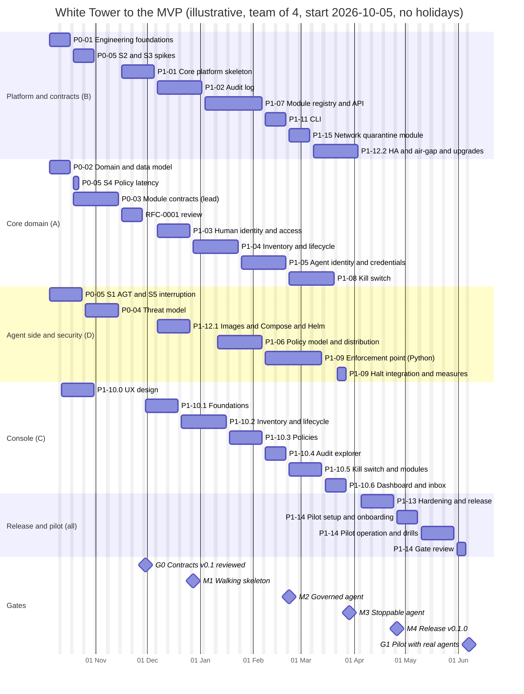

# White Tower: implementation roadmap to the MVP

| | |
| --- | --- |
| **Status** | Draft v0.1, open for review |
| **Date** | 2026-09-28; updated 2026-09-29 (ADR-0011; network quarantine adds one week) |
| **Related** | [Requirements](requirements/mvp-requirements.md), [Architecture](architecture/mvp-architecture.md), [ADRs](adr/README.md), [Implementation plans](plans/README.md) |

This roadmap puts the implementation plans in order: who does what, when, and which milestones prove progress, from an empty repository to the MVP (the Phase 1 gate). The charter leaves phases undated until the team is known. Durations are therefore given in weeks under a stated staffing assumption, and the calendar dates are illustrative.

---

## 1. At a glance

- **Two phases to the MVP.** Phase 0, Foundations: 8 weeks. Phase 1, Core MVP: 27 weeks, including 6 weeks of pilot.
- **Effort.** About 87 person-weeks for the individual plans, plus joint hardening and pilot work, roughly 112 person-weeks in total.
- **Calendar with four people: 35 weeks** from start to the Phase 1 gate, before holidays and contingency. Starting on Monday 2026-10-05, the illustrative dates are:
  - Phase 0 gate at the end of November 2026;
  - release v0.1.0 in late April 2027;
  - Phase 1 gate in early June 2027.

  With the year-end break and a 15 to 20% contingency, plan for **June to July 2027**.
- **Critical path.** Since network quarantine joined the MVP (one week more), it runs through the platform track: core skeleton → audit log → module API → CLI → network quarantine → high availability and air-gap → hardening → pilot. The core domain track (human identity → inventory → agent identity → kill switch → enforcement point) is one week shorter (section 6).
- **Two things to start now,** because they can delay everything: signing the pilot partner (before the Phase 0 gate) and the remaining spikes (S2 to S4). The Microsoft AGT spike is done: no-go, and White Tower builds its own enforcement point ([ADR-0011](adr/0011-own-python-enforcement-point.md)).
- **Progress (2026-09-30).** P0-02 and P0-05 are done, and P0-01 is done but for testing the development environment on macOS and Linux. P0-04 is done too, and P0-03 waits for the external review of RFC-0001. The ten founding ADRs are accepted, the Phase 1 team is confirmed, and the pilot environment is ready. The dates are re-baselined at G0 (section 11).

## 2. Assumptions

**Baseline team**

| Person | Workstream | Main plans |
| --- | --- | --- |
| A: backend lead (Go) | Core domain | P0-02, P0-03 (lead), P1-03, P1-04, P1-05, P1-08 |
| B: backend engineer (Go) | Platform and contracts | P0-01, P0-05 S2 and S3, P1-01, P1-02, P1-07, P1-11, P1-15, P1-12.2 |
| C: frontend engineer (TypeScript) | Console | P1-10.0 to P1-10.6 |
| D: platform and security engineer (Go and Python) | Agent side, deployment and security | P0-05 S1 and S5, P0-04, P1-12.1, P1-06, P1-09, P1-13 (lead) |

Part-time roles:

- A maintainer acting as product lead: runs the RFC process, secures the pilot partner, and works with committee members.
- An independent security reviewer, for P0-04 and P1-13.

**Other assumptions**

- One week is five working days of one person. Durations sit within the plan sizes of the [plans index](plans/README.md).
- The pilot partner signs before the Phase 0 gate. If not, the Phase 1 gate slips week for week.
- The AGT spike decided "no-go" ([ADR-0011](adr/0011-own-python-enforcement-point.md)). It adds no time: the spike showed that an adapter on AGT would have needed the same components as White Tower's own enforcement point.
- Week W1 starts on Monday 2026-10-05 in the illustrative calendar. Holidays are not modeled.

## 3. Milestones and gates

Every milestone ends with a recorded demonstration, a video or a script anyone can rerun, so progress is visible to the community.

| Milestone | Week (illustrative date) | What can be demonstrated | Plans done |
| --- | --- | --- | --- |
| **G0: Contracts v0.1 reviewed** (end of Phase 0) | W8 (2026-11-27) | The design package: accepted contracts, data model, threat model, measured NFR targets, pilot partner signed | P0-01 to P0-05 |
| **M1: Walking skeleton** | W12 (2026-12-25) | The core deployed with Compose and Helm; login through Keycloak with each role; audit events sealed and verified; the console shell | P1-01, P1-03, P1-12.1, the audit writer and sealer of P1-02 |
| **M2: Governed agent** | W20 (2027-02-19) | An agent goes from proposal to active through the API and the console, gets tokens, and its approved policies reach a mock enforcement point as signed bundles; decisions land in the audit log | P1-02, P1-04, P1-05, P1-06, P1-07 |
| **M3: Stoppable agent** | W25 (2027-03-26) | Real agents on two frameworks governed by White Tower's enforcement point; one agent and then the fleet halted from the console and confirmed live within targets, with the agent's pods quarantined on kind; conformance kit green | P1-08, P1-09, P1-15, P1-10.1 to P1-10.5 |
| **M4: Release v0.1.0** | W29 (2027-04-23) | A hardened, load-tested, signed release that installs air-gapped | P1-10, P1-11, P1-12, P1-13 |
| **G1: Pilot with real agents** (end of Phase 1: the MVP) | W35 (2027-06-04) | The four MVP criteria met in the pilot, with evidence | P1-14 |

## 4. Timeline

The same schedule as a table:

| Weeks | A: core domain | B: platform and contracts | C: console | D: agent side, deployment, security |
| --- | --- | --- | --- | --- |
| W1–W2 | P0-02 data model | P0-01 foundations | Console skeleton (P0-01), then P1-10.0 UX design (W2–W4) | P0-05 S1 AGT spike |
| W3–W6 | P0-03 contracts (lead); S4 in W3 | S2 and S3 spikes (W3–W4); P0-03 protobuf and events (W5–W6) | UX design validated with prospective users | S1 and S5 (to W3); P0-04 threat model (W4–W6) |
| W7–W8 | RFC-0001 review; P1-03 preparation | P1-01 skeleton (W7–W9) | Design system on generated mocks | Conformance kit design; pilot environment preparation |
| W9–W12 | P1-03 human identity (W10–W12) | P1-01 (W9); P1-02 audit log (W10–W13) | P1-10.1 foundations (W9–W11); P1-10.2 begins (W12) | P1-12.1 images, Compose, Helm (W10–W12) |
| W13–W16 | P1-04 inventory and lifecycle | P1-02 (W13); P1-07 module API (W14–W18) | P1-10.2 inventory screens (to W15); P1-10.3 policies (W16–W18) | Security test automation (W13–W14); P1-06 policies (W15–W18) |
| W17–W20 | P1-05 agent identity | P1-07 (to W18); P1-11 CLI (W19–W20) | P1-10.3 (to W18); P1-10.4 audit explorer (W19–W20) | P1-06 (to W18); P1-09 enforcement point (W19–W23) |
| W21–W26 | P1-08 kill switch (W21–W24); P1-13 preparation (W25–W26) | P1-15 network quarantine (W21–W22); P1-12.2 HA, air-gap, upgrades (W23–W26) | P1-10.5 kill switch and modules (W21–W23); P1-10.6 (W24–W25) | P1-09 (to W23); halt integration and measurements (W25); P1-13 preparation (W26) |
| W27–W29 | P1-13 hardening and release v0.1.0 (everyone, led by D) | | | |
| W30–W35 | P1-14 pilot: setup, onboarding, operation, drills, gate review (everyone) | | | |

The slack in track D (weeks 7 to 9 and 13 to 14) is deliberate: it absorbs the year-end break. Spike S1 finished before W1, which frees the weeks it had reserved.

## 5. How the phases unfold

**Phase 0 (W1–W8): decide before building.** The spikes, the data model and the foundations start on day one, in parallel. The contracts follow the data model; the threat model follows the first spike. The RFC review of the contracts runs in weeks 7 and 8, and the core skeleton starts at the same time, because it does not depend on the contracts. The console's UX design is validated with prospective users while nothing can be built yet.

**Phase 1, first half (W9–W20): a governed agent.** The core gains its audit log, logins and roles, then the inventory, agent credentials, policies and the module API. Every step is shown in the console as soon as its API exists: the console works against mocks generated from the OpenAPI document and never waits for the backend. **M2** proves the whole chain with the mock enforcement point.

**Phase 1, second half (W21–W29): a stoppable agent, then a release.** The kill switch and the enforcement point meet in week 25 (**M3**), with real agents stopped from the console and, on Kubernetes, isolated at the network level by the quarantine module. Deployment gains high availability, air-gap and upgrades. Three weeks of joint hardening produce v0.1.0 (**M4**).

**Pilot (W30–W35): prove it with real people.** Installation at the partner, onboarding of real agents through their real committees, operation, drills, evidence in the partner's SIEM, and the gate review (**G1**).

## 6. Critical path and where time can be won

**The critical path** runs through track B since network quarantine joined the MVP:

> P0-01 → P1-01 → P1-02 → P1-07 → P1-11 → P1-15 → P1-12.2 → P1-13 → P1-14

Track A (P1-01 → P1-03 → P1-04 → P1-05 → P1-08, then the halt integration of P1-09) finishes one week earlier, so it is nearly critical. The contracts branch (P0-03 → RFC-0001 → P1-07) has slack, and the console about two weeks.

**Where time can be won**

1. **Split P1-12.2.** Track D waits for P1-08 in week 24; it can build the air-gapped bundle of P1-12.2 then. This recovers the week that network quarantine added, at the cost of the slack at the end of Phase 1.
2. **A fifth person (Go)** can take P1-15, which also recovers that week. Taking P1-05 in parallel with P1-04 as well (credential management and the token endpoint do not need the complete lifecycle, only its states) shortens track A by about two more weeks, but the console then sets the pace unless its Should items move to v0.1.x.
3. **Prepare the pilot during P1-13:** environment, IdP integration and SIEM export ready before the release.
4. **Keep the console on generated mocks,** so it never waits for the backend.

**What must not be cut:** the drills in the pilot, the tamper and fail-closed tests, and the external review of the contracts. They are what makes White Tower trustworthy.

## 7. Scaling the team

| Team | Calendar to G1 (no holidays or contingency) | Comment |
| --- | --- | --- |
| 2 people (full stack: Go and TypeScript) | about 54 weeks (12 to 13 months) | Almost everything becomes sequential and the console is the bottleneck. Consider a thinner console for the pilot, relying on the CLI for operators. |
| 3 people (A, B and D; console shared) | about 41 weeks (9 to 10 months) | The console is built by B and D after their backend plans; UX design still happens early. |
| **4 people (baseline)** | **35 weeks (8 months)** | As scheduled above. |
| 6 people | about 31 weeks (7 months) | The critical path dominates. Extra people add more quality (tests, documentation, a second framework in the enforcement point) than speed. |

## 8. Schedule risks

| Risk | Effect | Response |
| --- | --- | --- |
| The enforcement point (ADR-0011) needs hooks for more frameworks than planned | Track D gains 1 to 2 weeks per extra framework | Start with LangGraph 1.x; choose the pilot's agents accordingly; subplans if more than two frameworks |
| The pilot's cluster cannot enforce deny rules, or the pilot runs on Docker | Network quarantine cannot be shown in the pilot | Agree on the environment in the pilot agreement; show it on the reference cluster at M3 and in P1-13 |
| Pilot partner not signed by G0 | G1 slips week for week | Start outreach now; fall back to the maintainers' own organizations |
| RFC-0001 needs a second round | P1-07 and P1-09 move by up to 2 weeks, partly absorbed by slack | Share drafts from week 4; invite external reviewers at the start |
| Year-end break (W12–W13 in the illustrative calendar) | About 2 weeks | Plan it; use track D's slack |
| The console (XL) slips | M3 and M4 slip | API first, generated mocks, early UX design; the Should items (UI-08, UI-09) can move to v0.1.x |
| One person per critical track (B, with A close behind) | Illness or departure delays everything | Pair reviews across tracks (B on P1-05 and P1-08, A on P1-07 and P1-15); keep designs written down |
| Spikes miss NFR targets | Architecture rework (for example the hash chain fallback for the audit log, or a broker) | Spikes in weeks 1 to 4, with fallbacks already named in the ADRs |

## 9. Gate checklists

### G0: "Contracts v0.1 reviewed" (end of Phase 0)

- [x] ADR-0001 to ADR-0010 accepted or amended: accepted by the maintainer (2026-09-30); ADR-0011 was accepted before.
- [x] Requirements v0.2: NFR targets set from measurements (P0-05); open questions Q1 to Q6 closed (2026-09-30).
- [x] Data model v0.1 and lifecycle specification approved (P0-02, 2026-09-29).
- [ ] RFC-0001 accepted with at least one external review; tag `contracts/v0.1.0` (P0-03). Approved by the maintainer (2026-09-30); the external review is pending.
- [x] Threat model v0.1 reviewed by the security reviewer (P0-04): reviewed and accepted by the maintainer (2026-09-30); an external review is planned before the pilot (P1-13).
- [x] Go or no-go on AGT recorded: no-go, White Tower builds its own enforcement point (P0-05 S1, ADR-0011).
- [ ] CI, release pipeline and development environment working on the three operating systems (P0-01). CI runs on every pull request; the release pipeline is deferred to the MVP (maintainer, 2026-09-30); the development environment still has to be tested on macOS and Linux.
- [x] Pilot partner signed (P1-14 step 1), which also closes Q7: the maintainer has the pilot environment ready (2026-09-30); its details are settled in P1-14.
- [x] Phase 1 team confirmed (2026-09-30). Only then do the dates of this roadmap become commitments.

### G1: "Pilot with real agents" (end of Phase 1, the MVP)

- [ ] Every pilot agent in the inventory with an active owner, a validated use case and an approved agent-specific policy.
- [ ] Governed agents authenticated by White Tower and governed at runtime by White Tower's enforcement point with White Tower policies.
- [ ] Evidence in the tamper-evident log, verified with the CLI and exported to the partner's SIEM, including a consistency check against a checkpoint held by the SIEM.
- [ ] Halts of one agent and of the fleet confirmed and measured within the Phase 0 targets; the partition drill failed closed; on Kubernetes, the halted agents' pods quarantined (KIL-10).
- [ ] Microsoft AGT re-tested live, with the result recorded for Phase 2 (P1-14, ADR-0011).
- [ ] Release v0.1.x signed and verifiable; no open critical or high finding.
- [ ] Gate report approved by the maintainers and the pilot sponsor, with Phase 2 priorities.

## 10. After the MVP

The charter's later phases, not scheduled yet. Their plans are written during the pilot (W30–W35), so work can start right after G1.

| Phase | Content | Gate |
| --- | --- | --- |
| **2: Key modules** | LLM gateway and quotas; MCP gateway; skills repository with review and signing; enforced per-agent harness (including stopping workloads, on top of the MVP's network quarantine). Also: a second policy engine to prove module replacement, per-task delegated tokens, strict mode for critical agents, a TypeScript enforcement point, and an interoperability adapter for Microsoft AGT. | One use case in production |
| **3: Ecosystem** | Shadow AI discovery; compliance module and GRC export; public third-party module SDK; public release; hosting in a foundation. | First third-party module |

The order of the Phase 2 modules is decided at G1 from what the pilot shows, for example whether the MCP gateway or the LLM gateway matters more to the first adopters.

## 11. Keeping the roadmap current

- The [plans index](plans/README.md) is the source of truth for plan status; this roadmap is reviewed at every milestone.
- After each gate, re-baseline the dates and record the variance and its causes.
- Dates become commitments only once the team is confirmed at G0, as the charter says.
