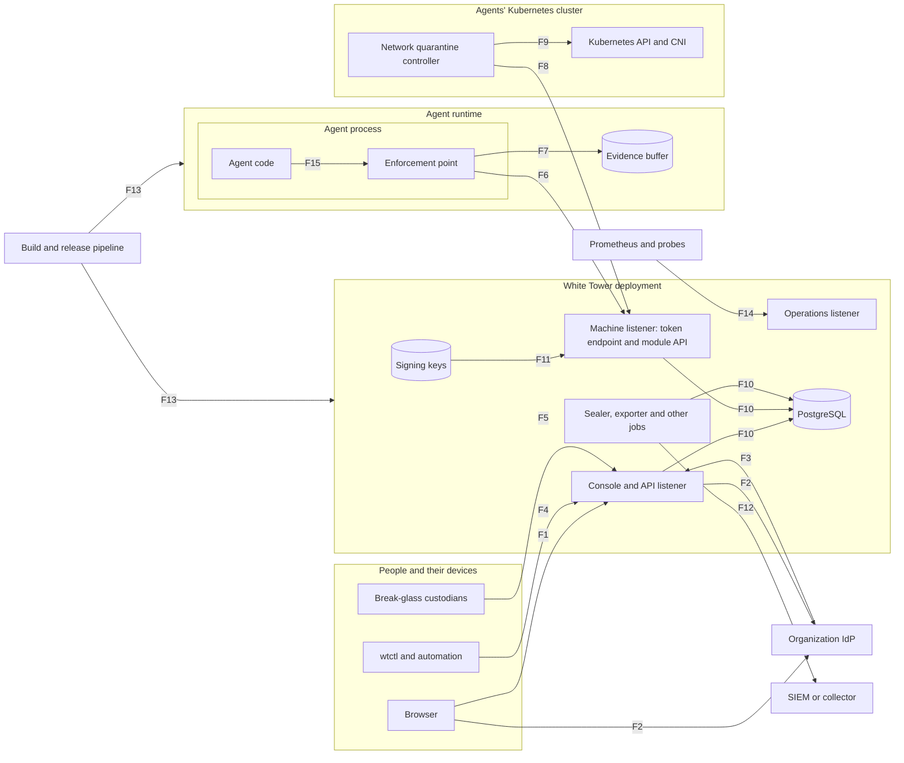

# Threat model v0.1

| | |
| --- | --- |
| **Status** | Version 0.1, reviewed and accepted by the maintainer on 2026-09-30 |
| **Date** | 2026-09-30 |
| **Plan** | [P0-04](../plans/phase-0/P0-04-threat-model.md) |
| **Models** | The MVP as designed: [architecture](../architecture/mvp-architecture.md), [ADRs](../adr/README.md), [module contracts v0.1](../contracts/module-contract-v0.1.md), [domain model](../architecture/domain-model.md) |
| **Related** | [Framework mapping](framework-mapping.md), [security test catalog](security-tests.md), [SECURITY.md](../../SECURITY.md) |

White Tower decides which AI agents may run, what they may do and when they must stop, and keeps the evidence. An attacker who subverts it can free an agent that should be stopped, make agents run policies nobody approved, or erase what happened. This document identifies what must be protected, who might attack it and how, and what the design does about each threat. Where the design fell short, it records a change; where a risk remains, it says so and why.

Identifiers: assumptions `A-`, threats `T-`, attack trees `AT-`, design changes `DC-`, accepted risks `R-`, security tests `ST-` (in the [catalog](security-tests.md)).

## 1. Scope and method

**In scope:** the core (console and API listener, machine listener, background jobs), the web console, `wtctl`, White Tower's enforcement point for Python agents, the network quarantine module, PostgreSQL as the core uses it, the audit export, and the release pipeline and its artifacts.

**Out of scope:** the modules of Phases 2 and 3 (gateways, harness, skills repository, discovery), which get their own analysis at each phase gate; the agents' own models, prompts and tools, except where White Tower governs them; the security of the organization's IdP, SIEM, Kubernetes control plane and hosts, which the assumptions below cover.

**Method.**

1. List the assets and the security objectives (section 2) and the threat actors (section 3).
2. Draw the data flows and mark the trust boundaries (section 4).
3. Apply STRIDE to every element and to every flow that crosses a boundary (section 5).
4. Build attack trees for the scenarios that matter most (section 6).
5. Link each threat to a control (a requirement, an ADR, a contract obligation or a plan step), to a design change (section 7) or to an accepted risk (section 8).
6. Turn the abuse cases into tests, each owned by a Phase 1 plan ([catalog](security-tests.md)).

**Rating.** Likelihood and impact are rated low, medium or high, before mitigation; the risk follows from this table. The residual column of section 5 gives the risk that remains once the mitigations are in place.

| Likelihood \ Impact | Low | Medium | High |
| --- | --- | --- | --- |
| **High** | Medium | High | High |
| **Medium** | Low | Medium | High |
| **Low** | Low | Low | Medium |

**Assumptions.** Each one is a condition the MVP relies on; if it fails, the threats listed become more likely.

| ID | Assumption | Threats if it fails |
| --- | --- | --- |
| A-1 | The organization's IdP authenticates people correctly, and the organization controls who is in each group | T-14, T-15 |
| A-2 | Hosts are time-synchronized (ASM-04) | T-20, T-32 |
| A-3 | The Kubernetes control plane and the nodes that run the core are not compromised; cluster administrators are trusted in the MVP | T-60 |
| A-4 | Operators distribute the core's TLS trust anchors and the bundle keys to modules through a channel they control | T-29, T-33 |
| A-5 | Audit checkpoints are exported to at least one system outside the reach of White Tower's database administrators ([ADR-0006](../adr/0006-tamper-evident-audit-log.md)) | T-51, T-52 |
| A-6 | Each agent's code, dependencies and deployment are controlled by its owner and the platform team; White Tower governs what the agent does, not how it is built | T-40, T-41 |

## 2. Assets and security objectives

Objectives: **C** confidentiality, **I** integrity, **A** availability.

| Asset | Owner component | Objectives | Why it matters |
| --- | --- | --- | --- |
| Token signing key (ES256) | `agentid` | C, I | Whoever holds it can mint tokens for any agent or module |
| Bundle signing key (Ed25519) | `policy` | C, I | Whoever holds it can sign the policies enforcement points apply |
| Checkpoint signing key (Ed25519) | `audit` | C, I | Whoever holds it can sign a false statement of the log's contents |
| Audit log: events, leaves, tree hashes, checkpoints | `audit` | I, A, and C for its personal data | The evidence of every decision and governance action (AUD-01 to AUD-04) |
| Policies, versions, approvals and bundles | `policy` | I | What every agent may do |
| Governance state and the halt channel: halts, releases, run states, leases, watch streams | `killswitch`, `govstate` | I, A | The ability to stop agents within seconds |
| Agent and module credentials (public keys), issued tokens | `agentid` | I, and C for tokens | Who may act as which agent or module |
| Human sessions, API tokens, the break-glass credential | `authn` | C, I | Who may act as which person |
| Principals, role mappings and bindings | `authz` | I | Who may approve, halt and release |
| Inventory: agents, owners, use cases, lifecycle, reviews | `inventory` | I | Which agents may run at all (INV-04) |
| Configuration, database credentials, backups | Deployment | C, I | Access to everything above |
| An enforcement point's trust anchors, bundle keys, agent key and evidence buffer | The enforcement point, in the agent's process | C, I, A | Whether that agent is governed and its evidence complete |
| Release artifacts: images, binaries, charts, the enforcement point package, the offline bundle | Release pipeline | I | Everything else runs from them |
| Personal data: names and emails of principals, pseudonymous IDs in evidence | `authn`, `audit` | C | Privacy obligations (NFR-20) |

**Security objectives.**

- **O-1 Integrity of governance.** Only approved policies reach agents; only authorized people change lifecycle states, policies, halts and roles; nobody approves their own work.
- **O-2 Verifiable evidence.** Any change to sealed evidence is detectable, even by a database administrator, as long as checkpoints are held outside (A-5).
- **O-3 A halt path that cannot be subverted.** A halt reaches connected enforcement points within NFR-03; one cut off from the core fails closed within its lease; a halt cannot be suppressed, or released by one person.
- **O-4 Protected credentials.** White Tower never holds agents' private keys; the three signing keys are separate; secrets are never logged.
- **O-5 Minimal personal data** (NFR-20).

The availability of agents comes after these: when the two conflict, White Tower fails closed and stops agents rather than let them act ungoverned ([ADR-0005](../adr/0005-edge-enforcement-with-leases.md)).

## 3. Threat actors

| ID | Actor | Capabilities | Motivations |
| --- | --- | --- | --- |
| TA-1 | External attacker | Reaches exposed listeners over the network; no credentials | Disrupt, steal data, gain a foothold |
| TA-2 | Hijacked agent | Acts with the agent's identity and tools after injected content changed its goal (OWASP ASI01); may gain code execution in its own process if it has such a tool | Whatever the injected instructions want: exfiltration, fraud, persistence |
| TA-3 | Compromised module or enforcement point | Holds a module's or an agent's credentials; sends any message the module API accepts | Hide activity, fake confirmations, poison evidence |
| TA-4 | Malicious agent owner | Controls the agent's code, configuration and deployment; holds the owner role | Keep the agent running despite committees or halts; hide what it did |
| TA-5 | Malicious operator | Registers modules, activates agents, halts and requests releases | Disrupt; activate agents without approval |
| TA-6 | Malicious platform administrator | Manages role mappings, bindings and settings; holds no approval right by default | Grant themselves power |
| TA-7 | Database administrator | Full access to PostgreSQL, including as superuser | Rewrite evidence or state |
| TA-8 | Cluster administrator | Reads Secrets, runs commands in pods, changes network rules and images | Any of the above, with more reach |
| TA-9 | Compromised IdP account or IdP administrator | Signs in as someone, or changes group membership | Act with another person's roles |
| TA-10 | Supply-chain attacker | Publishes packages, compromises CI, images or mirrors | Code execution in the core, the enforcement point or the console |

Committee members, owners and operators are also insiders. The design limits what one of them can do alone through separation of duties (HUM-04), and records what they do (AUD-01).

## 4. Data flows and trust boundaries

**Trust boundaries.**

| ID | Boundary | Flows | What crosses it |
| --- | --- | --- | --- |
| TB-1 | People and the console and API listener | F1, F4, F5 | Browsers, the CLI and automation, break-glass |
| TB-2 | Agent runtime and the machine listener | F6, F8 | Enforcement points and modules: tokens, state, bundles, acknowledgements, events |
| TB-3 | The core and PostgreSQL, with its administrators | F10 | All state and evidence |
| TB-4 | The core and the IdP | F2, F3 | Logins, identities, groups, deprovisioning |
| TB-5 | The core and the SIEM, and third-party verifiers | F12 | Evidence and checkpoints leaving White Tower |
| TB-6 | Cluster administration and White Tower's workloads and Secrets | F11 | Keys, configuration, images |
| TB-7 | The quarantine controller and the Kubernetes API | F9 | Deny rules, pod information |
| TB-8 | Build and distribution, and installations | F13 | Every artifact |
| TB-9 | The cluster network and the operations listener | F14 | Metrics and health |

**Not a boundary: the agent's code and its enforcement point.** They share one process (F15). Whatever runs in that process can read the enforcement point's memory and change its code. The enforcement point protects against an agent that is misled into a call, not against a process that is fully compromised. Section 5.5 and R-01 deal with the consequences.

**Data flows.**

| Flow | From, to | Protocol and authentication |
| --- | --- | --- |
| F1 | Browser to the console and API listener | HTTPS; `__Host-` session cookie and CSRF token ([ADR-0009](../adr/0009-human-auth-bff-sessions.md)) |
| F2 | Browser, IdP and core | OIDC authorization code with PKCE; the core as a confidential client |
| F3 | IdP to the core | SCIM 2.0 deprovisioning with a bearer token (HUM-05) |
| F4 | CLI and automation to the core | HTTPS; short-lived CLI tokens, personal access tokens and service accounts (HUM-07) |
| F5 | Break-glass custodian to the core | HTTPS; the sealed break-glass credential (HUM-06) |
| F6 | Enforcement point to the machine listener | TLS; client credentials with `private_key_jwt`, then bearer tokens: registration, heartbeats, `Watch`, bundles, acknowledgements, events ([contracts section 4](../contracts/module-contract-v0.1.md#4-module-api)) |
| F7 | Enforcement point to its evidence buffer | Local disk of the agent's host |
| F8 | Quarantine controller to the machine listener | As F6, with the module's identity |
| F9 | Quarantine controller to the Kubernetes API | Kubernetes RBAC with the controller's service account |
| F10 | Core to PostgreSQL | TLS; runtime role, migration role; `LISTEN/NOTIFY` |
| F11 | Key files to the core | Kubernetes Secrets mounted as files, or files on the host |
| F12 | Core to the SIEM | OTLP, JSON Lines, syslog over TLS; events and signed checkpoints |
| F13 | Release pipeline to installations | Registries and downloads; cosign signatures, SBOMs, provenance |
| F14 | Prometheus and kubelet to the operations listener | HTTP inside the cluster, behind network policies |
| F15 | Agent code to the enforcement point | Framework hooks inside one process |

## 5. STRIDE analysis

Each table covers the flows of one boundary. The rating is likelihood / impact → risk, before mitigation. **Bold** threats led to a design change.

### 5.1 TB-1: people and the console and API listener (F1, F4, F5)

| ID | STRIDE | Threat | Rating | Mitigations | Residual |
| --- | --- | --- | --- | --- | --- |
| T-01 | S | A stolen session lets an attacker act as a signed-in user | L / H → M | `__Host-`, `HttpOnly`, `Secure` cookie; no token reachable from JavaScript; HSTS; 30-minute idle and 12-hour absolute limits; rotation at login ([ADR-0009](../adr/0009-human-auth-bff-sessions.md), P1-03 steps 1 and 2) | Low |
| T-02 | T | Cross-site request forgery makes a signed-in user halt, approve or change something | M / H → H | `SameSite=Lax`, plus a CSRF token in a header on every state-changing request (P1-03 step 2) | Low |
| T-03 | E | A missing or wrong authorization check lets someone act beyond their role, or on agents they do not own | M / H → H | Deny by default, checked in the domain layer for every interface (HUM-03); tests for every role and permission pair; a test fails any handler that bypasses the engine (P1-03 step 5) | Low |
| T-04 | E | Self-approval: approving one's own policy version or use case, or releasing a halt alone | M / H → H | HUM-04 in the domain services; database triggers for policy approvals and halt releases; the lifecycle guard `not_owner_or_creator` ([lifecycle](../architecture/lifecycle.md)) | Low |
| T-05 | T, I | Stored cross-site scripting through content the console displays: agent metadata, policy text, manifests, and event fields written by enforcement points, which an attacker can influence | M / H → H | React's escaping and no raw HTML; a strict Content Security Policy with no inline script and no external source (NFR-12, P1-10); tokens out of JavaScript's reach limit the damage | Low |
| T-06 | S | An open redirect after login, used for phishing | M / L → L | Return URLs restricted to the console's own paths (P1-03 step 1) | Low |
| T-07 | R | Someone denies having halted, approved or changed something | L / M → L | Each change and its audit event in one transaction, with the actor (AUD-01); tamper-evident log | Low |
| T-08 | T | Two approvers silently overwrite each other's changes | M / M → M | Optimistic concurrency with ETags (API-03) | Low |
| T-09 | T | Formula injection through the inventory's CSV export (INV-09) | L / M → L | Cells that start with `=`, `+`, `-` or `@` are neutralized (P1-04) | Low |
| T-10 | I | Errors, logs or responses leak internals or secrets | M / M → M | RFC 9457 problem details without internals; secrets only from files and never logged (OPS-04, NFR-12); hardening review (P1-13 step 4) | Low |
| T-11 | D | Flooding the login or the API makes the console unusable when a halt is needed | M / M → M | Rate and size limits (architecture section 9); the CLI and break-glass as other paths; enforcement points on a separate listener | Low |
| T-12 | S, E | The break-glass credential is stolen or guessed | L / H → M | Disabled by default; high entropy, shown once, split between two custodians; rate-limited; the session only halts and reads, for one hour; every use raises a critical audit event, an alert and a console banner (HUM-06, P1-03 step 9) | R-12 |

### 5.2 TB-4: human identity and roles (F2, F3)

| ID | STRIDE | Threat | Rating | Mitigations | Residual |
| --- | --- | --- | --- | --- | --- |
| T-13 | S | A forged, replayed or substituted ID token: algorithm confusion, wrong audience, reused nonce | L / H → M | Issuer, audience, expiry, nonce and an allow-list of algorithms checked; PKCE and `state` (P1-03 step 1) | Low |
| T-14 | S | A phished or otherwise compromised IdP account acts with its owner's roles | M / H → H | MFA at the IdP (deployment guide); separation of duties stops one account approving its own work or releasing a halt; everything audited; deactivation revokes sessions | R-07 |
| T-15 | E | Whoever controls IdP groups grants approval roles | L / H → M | Role mapping audited; the console lists who holds each role; approvals still need two different people | R-07 |
| **T-16** | E | A platform administrator grants themselves, or an accomplice, an approval role through local bindings (HUM-02) | M / H → H | Binding changes are audited (P1-03 step 4); **DC-4**: nobody grants a role to themselves, and grants of steering, advisory or operator reach the steering committee | R-11 |
| T-17 | S | A stolen API token or personal access token, for example from a CI log | M / M → M | Stored hashed; a recognizable prefix for secret scanners; scoped; 90 days at most; last use recorded; revoked with the principal (P1-03 step 6); CLI tokens last 12 hours | Low |
| T-18 | D | A stolen SCIM token deactivates owners, whose agents are then suspended automatically | L / M → L | Token read from a file and rotated; deactivations audited and reversible; suspension fails safe | Low |
| T-19 | E | Roles removed at the IdP stay in open sessions until the next login | M / M → M | Local binding changes and deactivations revoke sessions at once; sessions last 12 hours at most; SCIM deprovisioning (HUM-05) | R-13 |

### 5.3 TB-2: machine identity, the token endpoint (F6, F8)

| ID | STRIDE | Threat | Rating | Mitigations | Residual |
| --- | --- | --- | --- | --- | --- |
| T-20 | S | A client assertion (`private_key_jwt`) is replayed | M / H → H | Single-use `jti` in a replay cache; audience equal to the token endpoint; expiry within 5 minutes; bounded clock skew (P1-05 step 4) | Low |
| T-21 | S | Algorithm or key confusion: `none`, HMAC keyed with a public key, an algorithm that does not match the registered key | M / H → H | The registered key's type fixes the algorithm; `go-jose`; negative tests and fuzzing ([ADR-0010](../adr/0010-built-in-agent-token-issuer.md), P1-05) | Low |
| T-22 | S | Audience confusion: a token issued for one resource is replayed to another | M / M → M | Resource indicators (RFC 8707) become `aud`; the module API accepts only its own audience (P1-05, P1-07) | Low |
| T-23 | S | A stolen agent private key lets an attacker act as that agent: tokens, events, acknowledgements | M / M → M | White Tower never holds agent keys (AID-02); the scope is that one agent (contracts 4.3); rotation and revocation (AID-05); halts stop tokens for other audiences (KIL-06); workload identity on Kubernetes avoids static keys (AID-07) | R-04 |
| T-24 | E | A token is issued to an agent just halted, suspended or retired | L / H → M | The gate reads governance state in the issuing transaction (ADR-0010, CORE-8); tokens expire within 5 minutes, and halts do not rely on tokens ([ADR-0005](../adr/0005-edge-enforcement-with-leases.md)) | Low |
| **T-25** | D, R | A halted or suspended agent's enforcement point gets no new token. Once its token expires, it can no longer deliver its evidence, report the later layers of the halt, or learn of the release; if the agent is then retired, its last evidence is never ingested | H / M → H | **DC-1**: those enforcement points keep getting tokens for the module API, and for nothing else | Low |
| T-26 | D | Flooding the token endpoint | M / M → M | Rate limits per client and in total; assertion checks are cheap | Low |

### 5.4 TB-2: the module API (F6, F8)

| ID | STRIDE | Threat | Rating | Mitigations | Residual |
| --- | --- | --- | --- | --- | --- |
| T-27 | E | An instance reads or acts on agents outside its scope, or publishes types or sources it does not own | M / H → H | Scope checked on every call (CORE-2); an enforcement point in an agent serves only that agent (EP-11); publication limited to declared types and owned sources (contracts 4.3) | Low |
| T-28 | S | An unapproved module, or a changed manifest, registers instances | L / H → M | MAN-1 to MAN-4: approval, manifest hash, re-approval of changes, revocation ending streams | Low |
| T-29 | T | A forged or tampered bundle reaches an enforcement point | L / H → M | Signed with the bundle key; keys from the enforcement point's configuration (A-4); bound to the manifest hash in the state; checks V1 to V7 ([contracts section 7](../contracts/module-contract-v0.1.md#7-policy-bundles)) | Low |
| T-30 | T | An older bundle is replayed | L / H → M | Versions only grow (V6); the state names the version and its hash (V3) | Low |
| T-31 | T | A stale replica, or a replayed stream, undoes a halt | L / H → M | CORE-5 and CORE-6; versions committed in order under an advisory lock ([spike S2](../spikes/S2-watch-streams.md)) | Low |
| **T-32** | T, D | A delayed stream. Something on the path (a proxy, a load balancer, a sidecar) buffers the `Watch` stream and releases it late. Renewals keep arriving at their usual pace, so leases never expire, while halts arrive as late as the attacker wants | L / H → M | Unacknowledged halts raise alerts (P1-08); **DC-2**: renewals carry the core's time, and one older than a tolerance on the instance's clock renews nothing | Low |
| T-33 | S | A server impersonating the core keeps an enforcement point open or feeds it state | L / H → M | TLS with trust anchors from configuration (I-1, A-4); bundles still need the configured keys | Low |
| T-34 | R, T | A compromised enforcement point acknowledges layers it did not apply | M / H → H | Layers reported separately, never overstated ([contracts 5.5](../contracts/module-contract-v0.1.md#55-halts)); network quarantine acknowledges independently on Kubernetes (KIL-10); halts stop tokens for other audiences; **DC-6**: the console flags allow decisions and executed actions after the gate was acknowledged closed | R-01 |
| T-35 | R | An enforcement point withholds events, or reports decisions that differ from what happened | M / M → M | Sequence numbers per source make gaps visible (AUD-02); from ingestion on, evidence is tamper-evident | R-03 |
| T-36 | D | An instance floods events; backpressure then slows every enforcement point until their buffers fill and their gates close | M / H → H | Message limits (contracts 4.8); per-instance rate limits and backpressure (P1-02 step 5); 24 hours of buffer (NFR-08) | Low |
| T-37 | D | Many streams, or slow readers, exhaust a replica | M / M → M | CORE-7 ends streams that fall behind; per-instance limits; about 50 KiB per stream (spike S2) | Low |
| T-38 | I | Governance state tells modules more than they need | L / L → L | No personal data but the owner's pseudonymous ID (CORE-9); halt reasons never leave the core | Low |
| T-39 | T | A replayed acknowledgement confirms a newer halt | L / M → L | Acknowledgements name the halt and carry an idempotency key (contracts 4.4) | Low |

### 5.5 Inside the agent's process (F7, F15)

| ID | STRIDE | Threat | Rating | Mitigations | Residual |
| --- | --- | --- | --- | --- | --- |
| T-40 | E, T | A hijacked agent that gains code execution in its process, or an owner who controls its code or configuration, disables or bypasses the enforcement point: patches the hooks, reads the agent's key, points it at other trust anchors, fakes acknowledgements and evidence | M / H → H | Policies deny code-execution tools an agent does not need; network quarantine outside the process on Kubernetes (KIL-10); halts stop tokens for other audiences; DC-6 flags activity after a halt; an enforced harness in Phase 2 | R-01 |
| T-41 | E | A governed call bypasses the framework hooks, for example a tool called through raw HTTP | M / H → H | Hooks on the framework's tool and model paths (P1-09); the conformance kit (MOD-05); gateways as choke points in Phase 2; network quarantine for halts | R-02 |
| T-42 | T | Unknown values in the state, from a newer core, open the gate | L / H → M | EP-10; the fail-closed vectors | Low |
| T-43 | D | The evidence buffer, or its disk, fills up and the gate closes | L / M → L | Sized for 24 hours at 10 events per second (NFR-08); `gate.evidence_full` reported | Low |
| T-44 | I | Decision events carry personal data | M / M → M | Argument names or an HMAC, never values; no prompts, outputs or error messages ([contracts 8.3](../contracts/module-contract-v0.1.md#83-personal-data), NFR-20) | Low |

### 5.6 TB-7: network quarantine (F8, F9)

| ID | STRIDE | Threat | Rating | Mitigations | Residual |
| --- | --- | --- | --- | --- | --- |
| **T-45** | E | Escaping the quarantine: deleting the rule, relabeling a pod, running pods without the label, or with the host's network | M / H → H | RBAC, and admission policies so that only the controller changes rules and running pods keep their label (P1-15 step 6); pods found per agent shown in the console; **DC-5**: labeled pods may not use the host network | R-09 |
| **T-46** | I | Data leaves a quarantined pod through cluster DNS | M / M → M | **DC-7**: no DNS during a quarantine by default | Low |
| T-47 | I | Connections opened before the quarantine survive it on some CNIs | M / M → M | Measured in P1-15 step 8; the gate still denies governed calls through them | R-09 |
| T-48 | T | The controller's credentials are stolen and quarantines lifted | L / H → M | Narrow RBAC, no access to workloads; reconciliation re-creates missing rules from the core's state (P1-15 step 4); a lift without a release shows in the audit log | Low |
| T-49 | D | The controller loses the core and applies no new quarantine | M / M → M | Alerts; the in-process gate and tokens still stop the agent; optional quarantine on lease expiry (RC-3) | R-09 |
| T-50 | T | The cluster's CNI does not enforce deny rules | M / H → H | Detected at installation; the console shows the layer as unavailable (ASM-05) | R-09 |

### 5.7 TB-3: the database and its administrators (F10)

| ID | STRIDE | Threat | Rating | Mitigations | Residual |
| --- | --- | --- | --- | --- | --- |
| T-51 | T | A database administrator modifies, deletes, inserts or reorders sealed audit events | M / H → H | Merkle tree with checkpoints signed by a key outside the database ([ADR-0006](../adr/0006-tamper-evident-audit-log.md)); verification detects each case (AUD-04) | Low, given A-5 |
| **T-52** | T | A database administrator rolls the log back: removes recent events and checkpoints, so that it still verifies against its own latest checkpoint | M / H → H | Consistency proof against a checkpoint held outside (AUD-04); **DC-8**: a scheduled consistency check against the SIEM's latest checkpoint | Low |
| T-53 | T, E | A database administrator changes governance state directly: activates an agent, removes a halt, marks a policy version approved. The core then signs bundles from it, and no audit event records the change | L / H → M | Database administration kept apart from White Tower's roles; the database's own audit log sent to the SIEM; append-only triggers make casual edits fail | R-06 |
| **T-54** | E | The serving core holds the migration role's credentials, so a compromised core can drop the append-only triggers | L / H → M | **DC-3**: migrations run in their own step with their own credentials | Low |
| T-55 | E | SQL injection | L / H → M | Queries generated with `sqlc`, never built from strings; the runtime role cannot change the schema or delete governance rows ([domain model section 9](../architecture/domain-model.md#9-physical-schema)) | Low |
| T-56 | I | A database dump exposes sessions, tokens or personal data | L / M → L | No private keys in the database (schema checks); session IDs and API tokens stored hashed; pseudonymous IDs in evidence; encrypted backups (P1-12 step 8) | Low |

### 5.8 TB-5: audit export and verification (F12)

| ID | STRIDE | Threat | Rating | Mitigations | Residual |
| --- | --- | --- | --- | --- | --- |
| T-57 | D | The exporter stops, and checkpoints stop leaving White Tower | M / M → M | Persisted cursor; health metrics and alerts per sink (P1-02 step 8) | Low |
| T-58 | S | Checkpoints forged with a stolen checkpoint key | L / H → M | Key outside the database; rotation; published public keys; a forged checkpoint conflicts with the genuine ones the SIEM holds | Low |
| T-59 | T | Exported evidence is altered in transit or at the SIEM | L / M → L | TLS to the collector; exported events verify offline against the signed checkpoints (`wtctl audit verify`) | Low |

### 5.9 TB-6: keys, configuration and backups (F11)

| ID | STRIDE | Threat | Rating | Mitigations | Residual |
| --- | --- | --- | --- | --- | --- |
| T-60 | I | A cluster administrator reads the key Secrets and forges tokens, bundles or checkpoints | L / H → M | Three separate keys; Secrets readable only by the core's service account; Kubernetes audit logging; rehearsed rotation (P1-13 step 5); KMS and HSM backends later | R-05 |
| T-61 | T | Development-only settings reach production, such as skipped TLS checks or the development IdP | M / H → H | The production image refuses development-only switches (P1-13 step 4); development credentials are public and out of scope ([SECURITY.md](../../SECURITY.md)) | Low |
| T-62 | I, T | Backups of the database and keys are stolen or tampered with | L / H → M | Keys backed up separately, offline and sealed; after a restore, the log is checked against exported checkpoints (P1-12 step 8) | Low |

### 5.10 TB-8: supply chain (F13)

| ID | STRIDE | Threat | Rating | Mitigations | Residual |
| --- | --- | --- | --- | --- | --- |
| T-63 | T | A malicious or vulnerable dependency in Go, npm or Python, including the native wheels of `cedarpy` | M / H → H | Pinned and reviewed dependencies; dependency review in CI; `govulncheck` and OSV; SBOMs (NFR-13) | R-10 |
| T-64 | T | The CI or release pipeline is compromised | L / H → M | Actions pinned by digest; read-only default permissions; protected branches and tags ([GOVERNANCE.md](../../GOVERNANCE.md)); signed artifacts with provenance, SLSA Build Level 3 as the target (NFR-13) | Low |
| T-65 | T | Artifacts are tampered with in a mirror or the offline bundle | L / H → M | cosign signatures and checksums, verifiable offline (OPS-03, [verifying releases](../verify-release.md)) | Low |
| T-66 | S | Typosquatting or dependency confusion on the enforcement point's Python package | M / H → H | Published with trusted publishing and attestations; exact versions and hashes pinned in the installation guide (P1-09, P1-12) | Low |
| T-67 | T | A malicious third-party module | L / H → M | Operators approve manifests (MOD-02); a module acts only within its scope and permissions (contracts 3.3 and 4.3) | R-10 |

### 5.11 TB-9: the operations listener (F14)

| ID | STRIDE | Threat | Rating | Mitigations | Residual |
| --- | --- | --- | --- | --- | --- |
| T-68 | I | Metrics or health endpoints reveal agent IDs and counts | L / L → L | A cluster-internal listener behind network policies; no personal data in metric labels | Low |

### 5.12 Availability and scope of governance (cross-cutting)

| ID | STRIDE | Threat | Rating | Mitigations | Residual |
| --- | --- | --- | --- | --- | --- |
| T-69 | D | Cutting enforcement points off the core stops agents once their leases expire | M / H → H | Accepted by design: an attacker can stop agents, never free them (ADR-0005); high availability, lease TTLs per risk tier, alerts on lease health | R-08 |
| T-70 | D | A database or core outage longer than the lease TTL stops the fleet | M / H → H | Highly available PostgreSQL (P1-12 step 4) and core (NFR-06) | R-08 |
| T-71 | D | An insider, or a break-glass holder, halts the fleet | L / H → M | A reason is required; audited; alerts; releasing needs two people (KIL-05) | R-12 |
| T-72 | D | Expensive queries on the public API, such as audit searches, exhaust the core | M / M → M | Pagination, a maximum page size, query timeouts, rate limits; enforcement points on another listener | Low |
| T-73 | E | A non-production credential is used in production: an agent only `validated` runs where production data lives, with a token nothing checks | M / M → M | Credentials and tokens carry the environment (`wt_env`); production resources that accept White Tower tokens must require `wt_env=production` (deployment guide); gateways enforce it in Phase 2 | R-14 |

## 6. Attack trees

Each tree starts from an attacker's goal. Branches are alternatives unless marked "and". Every leaf ends in a mitigation, an accepted risk or a design change.

### AT-1: keep a halted agent acting

- Stop the halt from reaching the enforcement point:
  - cut the stream: the lease expires and the enforcement point fails closed within its TTL (T-69, KIL-04);
  - delay the stream while renewals keep the lease alive (T-32): **DC-2**;
  - serve older state from a stale replica (T-31): CORE-5 and CORE-6;
  - impersonate the core (T-33): I-1.
- Make the enforcement point ignore the halt:
  - compromise the agent's process (T-40): network quarantine on Kubernetes; otherwise R-01;
  - act through calls the hooks do not see (T-41): network quarantine; otherwise R-02;
  - send values it does not know (T-42): EP-10.
- Escape the network quarantine (T-45 to T-50): admission policies, **DC-5**, **DC-7**; the rest is R-09.
- Fake the confirmation so nobody escalates (T-34): layered acknowledgements, the independent quarantine layer, **DC-6**.
- Release the halt without authority:
  - alone: the database trigger requires an approved request from a second person (T-04);
  - with two colluding or compromised accounts: R-11;
  - by editing the database (T-53): R-06;
  - by calling it a drill: drills are declared at issuance and target one agent (domain model).
- Stop the halt from being issued: flood the console (T-11): rate limits, the CLI, break-glass; the IdP is down: break-glass (HUM-06).

### AT-2: make agents enforce a policy nobody approved

- Forge a bundle: needs the bundle key (T-29, T-60): keys from configuration; R-05 for cluster administrators.
- Tamper with a bundle in transit or at rest (T-29): V2 to V5.
- Replay an older bundle (T-30): V3 and V6.
- Get the core to sign an unapproved policy:
  - approve one's own version (T-04): database trigger;
  - grant oneself an approval role (T-16): **DC-4**;
  - control IdP groups (T-15): R-07;
  - mark the version approved in the database (T-53): R-06.
- Point the enforcement point at other keys: needs control of the agent's deployment (T-40): R-01.

### AT-3: rewrite audit history without detection

- Modify, delete, insert or reorder sealed events (T-51): Merkle tree and signed checkpoints.
- Rebuild the tree and sign new checkpoints: needs the checkpoint key (T-58), and still conflicts with exported checkpoints (A-5).
- Roll the log back to an earlier state (T-52): consistency against an exported checkpoint, **DC-8**.
- Suppress evidence before it is sealed:
  - the enforcement point drops or edits events (T-35): gaps are visible; R-03;
  - a halted enforcement point cannot deliver its buffer (T-25): **DC-1**;
  - stop the exporter so no checkpoint leaves (T-57): alerts.
- Change state without an event: the core writes both in one transaction (AUD-01); a direct database edit is T-53, R-06.

### AT-4: activate an agent nobody approved

- Validate one's own use case, or approve one's own policy (T-04): domain services and database triggers.
- Gain an approval role: through local bindings (T-16), **DC-4**; through IdP groups (T-15), R-07.
- Call the lifecycle API past a missing check (T-03): matrix tests.
- Edit the database (T-53): R-06.
- Skip activation and use a non-production credential in production (T-73): R-14.

### AT-5: steal or replay agent tokens, or confuse their algorithm or audience

- Steal the agent's key (T-23): R-04; revocation; workload identity (AID-07).
- Replay a client assertion (T-20): the `jti` replay cache.
- Steal an access token from logs, memory or the network: 5-minute lifetime, TLS, never logged (T-10), audience-bound (T-22).
- Algorithm confusion (T-21): the algorithm follows the registered key.
- Audience confusion (T-22): resource indicators and `aud` checks.
- Forge tokens with the signing key (T-60): R-05.
- Get a token for a halted agent (T-24): the gate in the issuing transaction.

### AT-6: an enforcement point that lies

- Acknowledge a halt layer that is not in place (T-34): layers never overstate; the quarantine layer is independent; **DC-6**; R-01 outside Kubernetes.
- Report denials for calls it allowed, or invent events (T-35): R-03.
- Withhold events (T-35): sequence gaps.
- Act for an agent it does not serve (T-27): CORE-2.
- Claim a state version it has not applied: its lag shows in the console (EP-12).

### AT-7: turn fail-closed into a fleet-wide denial of service

- Cut the network between enforcement points and the core (T-69): R-08.
- Take the core down through its listeners (T-11, T-26, T-36, T-37, T-72): rate limits, per-instance limits, separate listeners.
- Take the database down (T-70): high availability; R-08.
- Fill the enforcement points' buffers through backpressure (T-36): per-instance backpressure.
- Issue a fleet halt as an insider or break-glass holder (T-71): R-12.
- Deactivate owners in bulk through SCIM (T-18): reversible, audited.
- Skew a host's clock so that fresh renewals look stale (DC-2): needs control of the host's time (A-2); the enforcement point reports the stale renewals.

### AT-8: compromise the supply chain

- Publish a malicious dependency (T-63): pinning, review, scanning; R-10.
- Compromise CI or the release pipeline (T-64): pinned actions, least privilege, protected tags, provenance.
- Tamper with an artifact in a mirror or the offline bundle (T-65): signatures verified offline.
- Typosquat the enforcement point's package (T-66): trusted publishing, pinned hashes.
- Ship a malicious module (T-67): operator approval, scopes; R-10.

### AT-9: abuse the break-glass credential

- Steal it from its custodians (T-12): split custody, shown once, rotated after each use.
- Guess it: high entropy and rate limits.
- Do more than halt: the session only halts and reads (P1-03 step 9).
- Release a halt with it: releasing needs two principals from the IdP (KIL-05).
- Use it unnoticed: a critical audit event, an alert and a console banner.
- Halt the fleet with it (T-71): its purpose; R-12.

## 7. Design changes

The analysis found eight gaps in the design. Each change is applied in the documents listed.

| ID | Threats | Change | Where | Status |
| --- | --- | --- | --- | --- |
| DC-1 | T-25 | The enforcement point of a halted or suspended agent keeps getting tokens for the module API, and only for it: it can still acknowledge, deliver its evidence and learn of a release, while every other audience stays closed. Retired agents get none; P1-05 decides whether a retired agent gets a short delivery-only period | AID-04, KIL-06, [ADR-0010](../adr/0010-built-in-agent-token-issuer.md), CORE-8 and contracts section 11, architecture section 5.3, P1-05 step 5, P1-08 step 2 | Applied |
| DC-2 | T-32 | Lease renewals carry the core's time. An instance ignores a renewal older than a tolerance on its own clock (5 seconds by default, configurable), so a delayed stream lets leases expire instead of delaying halts. This relies on A-2, which tokens already need | Contracts sections 4.8, 5.2 (CORE-6), 5.3 and 11; the `LeaseRenewal` message; conformance scenario S-17; KIL-04 and ASM-04 | Applied |
| DC-3 | T-54 | Migrations run in their own step, `whitetower migrate` (an init container on Kubernetes, a one-off service in Compose), with the migration role. The serving process holds only the runtime role's credentials | OPS-07, architecture section 8.2, P1-01 step 4, P1-12 step 3 | Applied |
| DC-4 | T-16 | Nobody grants a role to themselves. Grants of steering, advisory or operator notify the steering committee's inbox | HUM-04, P1-03 step 4 | Applied |
| DC-5 | T-45 | Pods carrying an agent label may not use the host's network, which deny rules cannot reach | P1-15 step 6 | Applied |
| DC-6 | T-34, T-40 | "Activity after a halt" is defined precisely: an allow decision or an executed action whose time is after the gate was acknowledged closed. Buffered evidence delivered later (DC-1) is expected and not flagged | P1-08 step 4 | Applied |
| DC-7 | T-46 | Quarantined pods get no DNS by default. The enforcement point reconnects to the core's last resolved addresses; a CNI with DNS-aware rules may allow the core's name only, as an option | P1-15 step 3, P1-09, contracts section 12 (the open question is closed) | Applied |
| DC-8 | T-52 | A scheduled consistency check proves the current log extends the latest checkpoint the SIEM holds, and alerts on failure | P1-02 step 7, P1-12 step 9 | Applied |

## 8. Accepted risks

Each risk stays open knowingly: the MVP cannot remove it without a component or a trust change it does not have. The maintainers own them all, and review them at every phase gate.

| ID | Risk | Threats | Why it is accepted | Compensating controls | Revisit |
| --- | --- | --- | --- | --- | --- |
| R-01 | The in-process enforcement point trusts the agent's process: an agent or owner that controls the process can bypass it and fake its reports | T-34, T-40 | Enforcement has to live where the calls are made ([ADR-0011](../adr/0011-own-python-enforcement-point.md)); no in-process design survives full control of the process | Network quarantine on Kubernetes; tokens stop for other audiences; DC-6 flags activity after a halt; code-execution tools denied by policy | Phase 2: the harness module and the gateways add stops outside the process |
| R-02 | Calls that do not go through the framework's hooks are not governed | T-41 | The hooks cover what the frameworks expose; raw network calls from agent code are outside them | Conformance kit; network quarantine; coverage levels shown per agent | Phase 2 gateways as choke points |
| R-03 | Until it is ingested, evidence is only as trustworthy as the agent's host | T-35 | The buffer lives next to the agent, which could edit it | Sequence gaps detected; tamper-evident from ingestion; tools' own logs as a cross-check | When a gateway can attest events |
| R-04 | A stolen agent key works until it is rotated or revoked | T-23 | White Tower never holds the private key, so it cannot protect it | One-agent scope; halts stop tokens for other audiences; revocation; workload identity (AID-07) | With SPIFFE SVIDs (AID-09) |
| R-05 | Cluster administrators can read the signing keys | T-60 | Keys come from files or Secrets in the MVP | Separate keys, Secrets RBAC, Kubernetes audit logs, rehearsed rotation | KMS and HSM backends (Phase 2) |
| R-06 | A database administrator can change governance state without leaving an audit event | T-53 | PostgreSQL's administrators can bypass any in-database control | Separation between database administration and White Tower roles; the database's audit log in the SIEM; tamper-evident evidence | A reconciliation of state against evidence, a Phase 2 candidate |
| R-07 | White Tower trusts the IdP for identities and group membership | T-14, T-15 | HUM-01: humans authenticate only through the organization's IdP | MFA at the IdP; separation of duties; audit; role holders visible | At each gate |
| R-08 | Fail-closed turns a long outage of the core, the database or the network into a fleet outage | T-69, T-70 | Chosen in ADR-0005: agents must not act ungoverned | High availability; TTLs per risk tier; alerts on lease health | With the strict mode of Phase 2 |
| R-09 | Network quarantine has gaps: pods without the label, CNIs that cannot deny, connections opened before the rule, a controller cut off from the core | T-45, T-47, T-49, T-50 | It depends on the cluster (ASM-05) | Pods found per agent; the layer shown as unavailable; the in-process gate; optional quarantine on lease expiry | Phase 2 harness module |
| R-10 | Dependencies and approved modules are trusted code | T-63, T-67 | Every system runs code it did not write | Pinning, review, scanning, SBOMs; module approval and scopes | Continuous |
| R-11 | Two colluding or compromised people can pass any two-person control | T-16, AT-1, AT-2 | Separation of duties raises the bar to two people; it cannot remove it | Audit of every step; approval-role grants notified (DC-4) | At each gate |
| R-12 | A break-glass holder can halt the fleet | T-12, T-71 | That is its purpose, for when the IdP is down | Split custody; one-hour sessions; loud audit and alerts; two-person release | At each gate |
| R-13 | Without SCIM, a role removed at the IdP stays in open sessions for up to 12 hours | T-19 | Roles are read at login | Local changes revoke sessions at once; SCIM deprovisioning | If pilots ask for shorter sessions |
| R-14 | Non-production credentials can be used in production until something checks the environment | T-73 | In the MVP, nothing between agents and their tools checks tokens | `wt_env` in every token; the deployment guide asks production resources to require it | Phase 2 gateways |

## 9. Security tests

The abuse cases above become tests in the [security test catalog](security-tests.md). Each test has an owner plan, and each Phase 1 plan's acceptance criteria require its tests to pass. P1-13 runs the whole catalog before the first release.

## 10. Review and upkeep

- **Review.** The maintainer, who did not write it, reviewed and accepted this version on 2026-09-30. An external security review is still planned before the pilot, with the release review of P1-13.
- **Upkeep.** As [GOVERNANCE.md](../../GOVERNANCE.md) sets out, the threat model is reviewed at every phase gate, whenever a trust boundary changes, and in the security section of every RFC. Plan P1-13 publishes version 0.2, checked against the implementation.

| Version | Date | Change |
| --- | --- | --- |
| 0.1 | 2026-09-30 | First version (P0-04) |
